# JSXGraph 指令参数与中文说明

这份文档按“指令 / 人话说明 / 调用示例 / 技术说明 / 与 GeoGebra 是否一致”整理，适合先快速看懂这个指令是干嘛的，再直接抄示例调用。

- 版本依据：`jsxgraph@1.12.2`
- 目标：快速看懂“这个指令怎么调用、是干嘛的”
- 说明：这里的“调用示例”以 VueGraphX demo 页里的可运行示例为准，优先保证能直接照着写
- 对比口径：按 GeoGebra 公开命令/工具的核心语义来分成“一致 / 部分一致 / 不一致”
- 本地查看：启动 `npm run dev` 后，可打开 `http://localhost:5174/test-vuegraphx-all-commands.html`
- 在线查看：GitHub Pages 会一起发布这个 demo，可直接打开 `https://zyizyiz.github.io/VueGraphX/test-vuegraphx-all-commands.html`

如果你想直接点指令、立刻看图形效果，优先打开上面的 demo 页；文档更适合查名称、抄调用代码、看效果图，以及快速判断它和 GeoGebra 的对应关系。

<table style="width:100%; table-layout:fixed;">
  <thead>
    <tr>
      <th>指令</th>
      <th>说明</th>
      <th style="width:160px;">调用示例</th>
      <th>技术说明</th>
      <th style="width:110px;">与 GeoGebra 是否一致</th>
      <th>效果图</th>
    </tr>
  </thead>
  <tbody>
    <tr>
      <td><code>angle</code></td>
      <td>拿三个点就能画出一个角。</td>
      <td style="width:260px;"><pre style="margin:0; white-space:pre-wrap; word-break:break-word; overflow-wrap:anywhere; font-size:12px;"><code>board.create(&#x27;angle&#x27;, [A, B, C], { radius: 1.2 });</code></pre></td>
      <td>创建角对象，用三个点定义顶点与两条边；也可基于两条线构造带半径的角。</td>
      <td><strong>一致</strong></td>
      <td>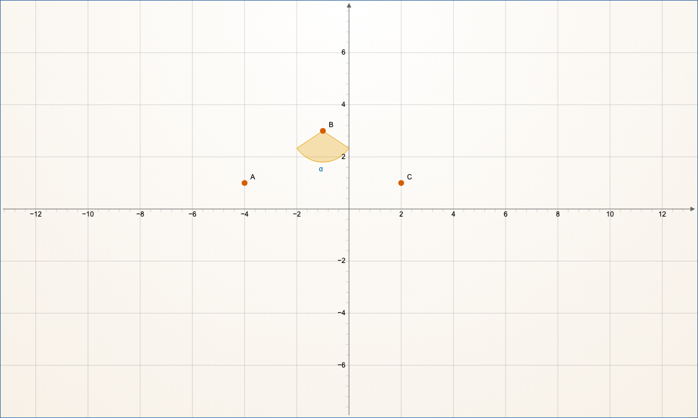</td>
    </tr>
    <tr>
      <td><code>arc</code></td>
      <td>从一个圆里截出一段弧。</td>
      <td style="width:260px;"><pre style="margin:0; white-space:pre-wrap; word-break:break-word; overflow-wrap:anywhere; font-size:12px;"><code>board.create(&#x27;arc&#x27;, [A, B, C]);</code></pre></td>
      <td>创建圆弧，第一点是圆心，第二点确定半径，第三点确定终止角度。</td>
      <td><strong>一致</strong></td>
      <td>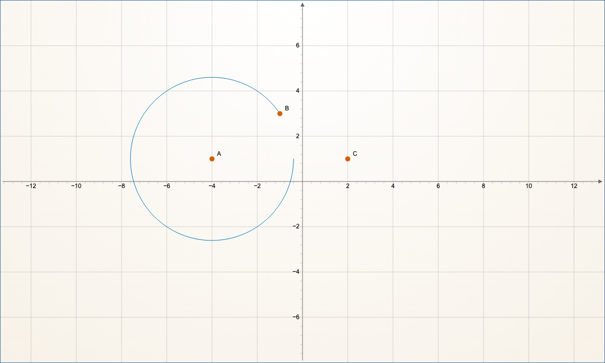</td>
    </tr>
    <tr>
      <td><code>arrow</code></td>
      <td>画一条带箭头的线，表示方向更直观。</td>
      <td style="width:260px;"><pre style="margin:0; white-space:pre-wrap; word-break:break-word; overflow-wrap:anywhere; font-size:12px;"><code>board.create(&#x27;arrow&#x27;, [A, B]);</code></pre></td>
      <td>创建带箭头的线段/直线表示，常用于向量或方向标记。</td>
      <td><strong>部分一致</strong></td>
      <td>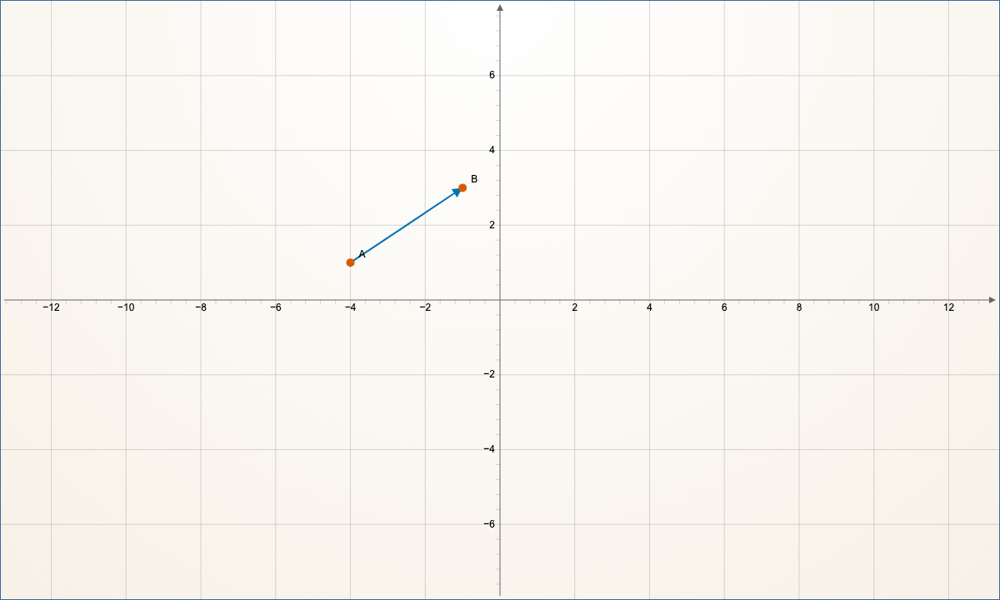</td>
    </tr>
    <tr>
      <td><code>arrowparallel</code></td>
      <td>画一条带箭头、并且和现有方向平行的线。</td>
      <td style="width:260px;"><pre style="margin:0; white-space:pre-wrap; word-break:break-word; overflow-wrap:anywhere; font-size:12px;"><code>board.create(&#x27;arrowparallel&#x27;, [A, B, C]);</code></pre></td>
      <td>创建一条经过 `p3` 且与 `p1-p2` 平行的箭头线段。</td>
      <td><strong>部分一致</strong></td>
      <td>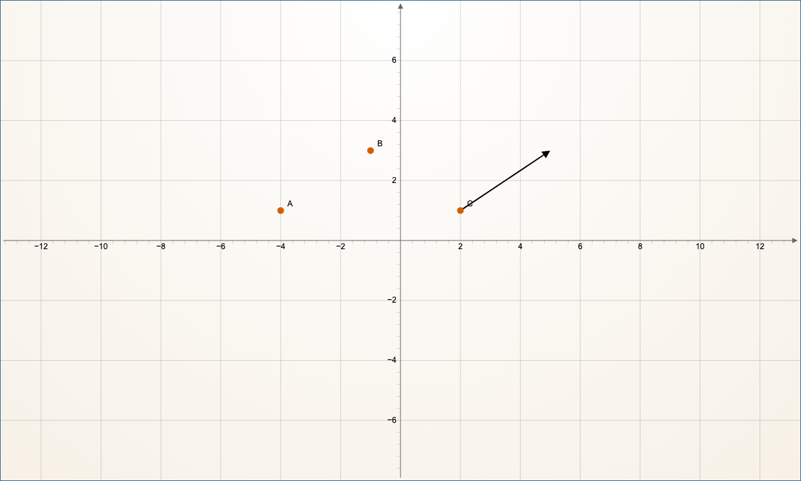</td>
    </tr>
    <tr>
      <td><code>axes3d</code></td>
      <td>3D 坐标轴那一整套壳子，通常系统自己就会带上。</td>
      <td style="width:260px;"><pre style="margin:0; white-space:pre-wrap; word-break:break-word; overflow-wrap:anywhere; font-size:12px;"><code>// 通常由 view3d 内部管理
const view = engine3d.getView3D();</code></pre></td>
      <td>创建 3D 坐标轴及相关背景平面容器，一般不单独手工使用。</td>
      <td><strong>部分一致</strong></td>
      <td></td>
    </tr>
    <tr>
      <td><code>axis</code></td>
      <td>就是坐标轴本体，不只是普通直线。</td>
      <td style="width:260px;"><pre style="margin:0; white-space:pre-wrap; word-break:break-word; overflow-wrap:anywhere; font-size:12px;"><code>board.create(&#x27;axis&#x27;, [[0, 0], [1, 0]]);</code></pre></td>
      <td>创建二维坐标轴，本质上是带刻度和标签的直线。</td>
      <td><strong>部分一致</strong></td>
      <td>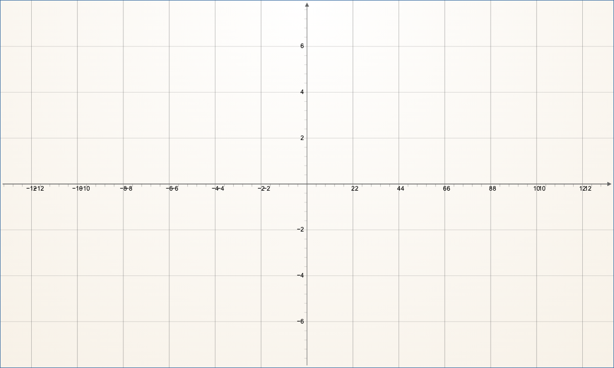</td>
    </tr>
    <tr>
      <td><code>axis3d</code></td>
      <td>3D 里的单根坐标轴。</td>
      <td style="width:260px;"><pre style="margin:0; white-space:pre-wrap; word-break:break-word; overflow-wrap:anywhere; font-size:12px;"><code>view.create(&#x27;axis3d&#x27;, [[0, 0, 0], [4, 0, 0]]);</code></pre></td>
      <td>创建三维坐标轴线，可带 3D 刻度与标签。</td>
      <td><strong>部分一致</strong></td>
      <td></td>
    </tr>
    <tr>
      <td><code>bisector</code></td>
      <td>把一个角从中间平分开。</td>
      <td style="width:260px;"><pre style="margin:0; white-space:pre-wrap; word-break:break-word; overflow-wrap:anywhere; font-size:12px;"><code>board.create(&#x27;bisector&#x27;, [A, B, C]);</code></pre></td>
      <td>创建角平分线，平分由三点确定的夹角。</td>
      <td><strong>一致</strong></td>
      <td>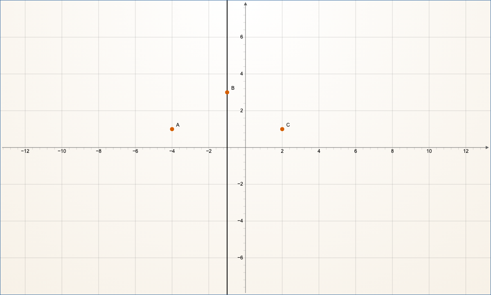</td>
    </tr>
    <tr>
      <td><code>bisectorlines</code></td>
      <td>给你两条线，直接找它们夹角的平分线。</td>
      <td style="width:260px;"><pre style="margin:0; white-space:pre-wrap; word-break:break-word; overflow-wrap:anywhere; font-size:12px;"><code>board.create(&#x27;bisectorlines&#x27;, [lAB, lCD]);</code></pre></td>
      <td>创建两条线形成角后的角平分线组合。</td>
      <td><strong>部分一致</strong></td>
      <td>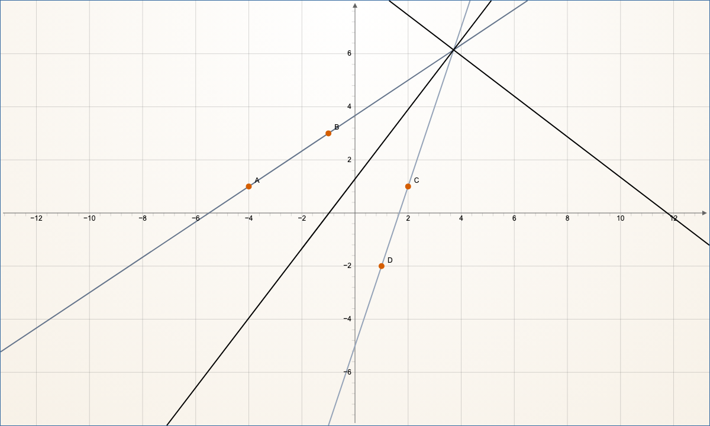</td>
    </tr>
    <tr>
      <td><code>boxplot</code></td>
      <td>统计课里常见的箱线图。</td>
      <td style="width:260px;"><pre style="margin:0; white-space:pre-wrap; word-break:break-word; overflow-wrap:anywhere; font-size:12px;"><code>board.create(&#x27;boxplot&#x27;, [[1, 3, 4, 6, 8], 1, 0.8], { dir: &#x27;vertical&#x27; });</code></pre></td>
      <td>创建箱线图，用于统计数据的分位数可视化。</td>
      <td><strong>一致</strong></td>
      <td>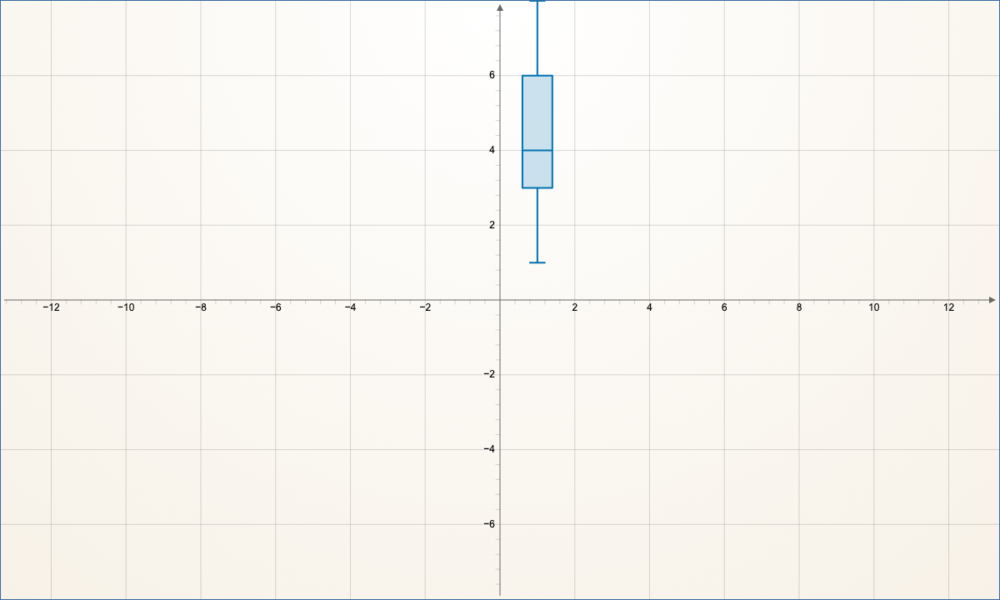</td>
    </tr>
    <tr>
      <td><code>button</code></td>
      <td>往画板里塞一个可以点的按钮。</td>
      <td style="width:260px;"><pre style="margin:0; white-space:pre-wrap; word-break:break-word; overflow-wrap:anywhere; font-size:12px;"><code>board.create(&#x27;button&#x27;, [-7, 7, &#x27;点我&#x27;, () =&gt; alert(&#x27;clicked&#x27;)]);</code></pre></td>
      <td>创建 HTML 按钮控件，点击后执行回调函数。</td>
      <td><strong>一致</strong></td>
      <td>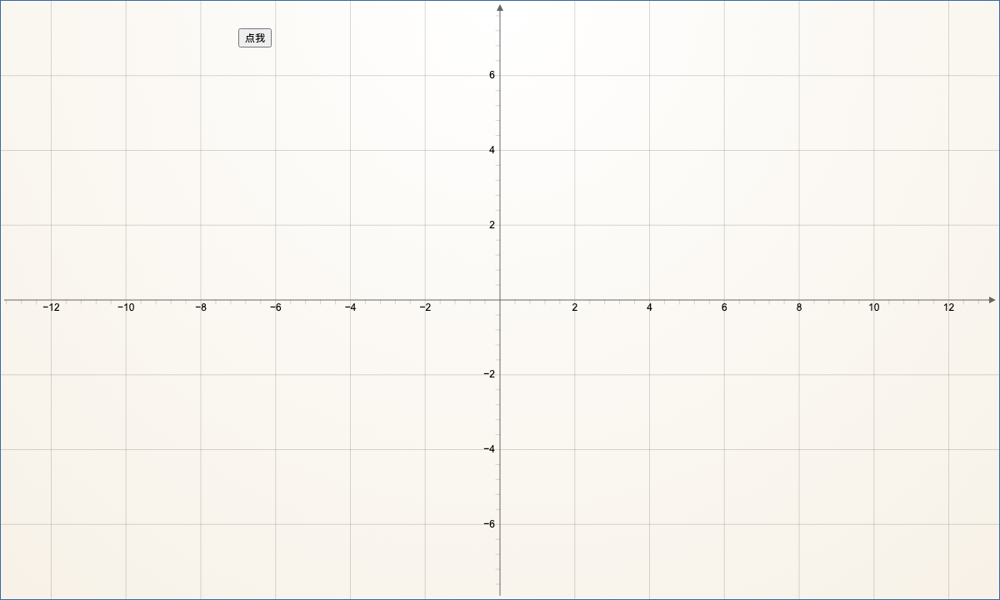</td>
    </tr>
    <tr>
      <td><code>cardinalspline</code></td>
      <td>把几个点顺滑地连成一条曲线。</td>
      <td style="width:260px;"><pre style="margin:0; white-space:pre-wrap; word-break:break-word; overflow-wrap:anywhere; font-size:12px;"><code>board.create(&#x27;cardinalspline&#x27;, [[A, B, C, D], 0.6, &#x27;uniform&#x27;]);</code></pre></td>
      <td>创建 Cardinal 样条曲线，用一组点平滑插值。</td>
      <td><strong>部分一致</strong></td>
      <td>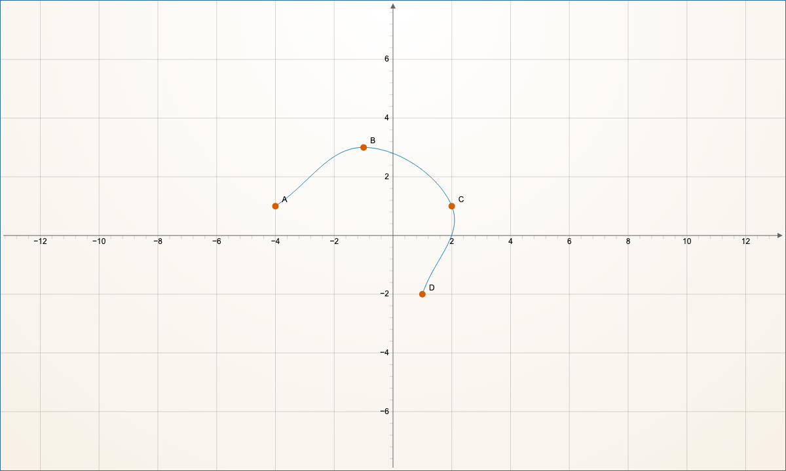</td>
    </tr>
    <tr>
      <td><code>chart</code></td>
      <td>画数据图，折线图柱状图这些都算。</td>
      <td style="width:260px;"><pre style="margin:0; white-space:pre-wrap; word-break:break-word; overflow-wrap:anywhere; font-size:12px;"><code>board.create(&#x27;chart&#x27;, [[1, 2, 3, 4], [2, 1, 3, 2]], { chartStyle: &#x27;line,point&#x27; });</code></pre></td>
      <td>创建图表，可用于折线、柱状、饼图、样条等数据展示。</td>
      <td><strong>部分一致</strong></td>
      <td>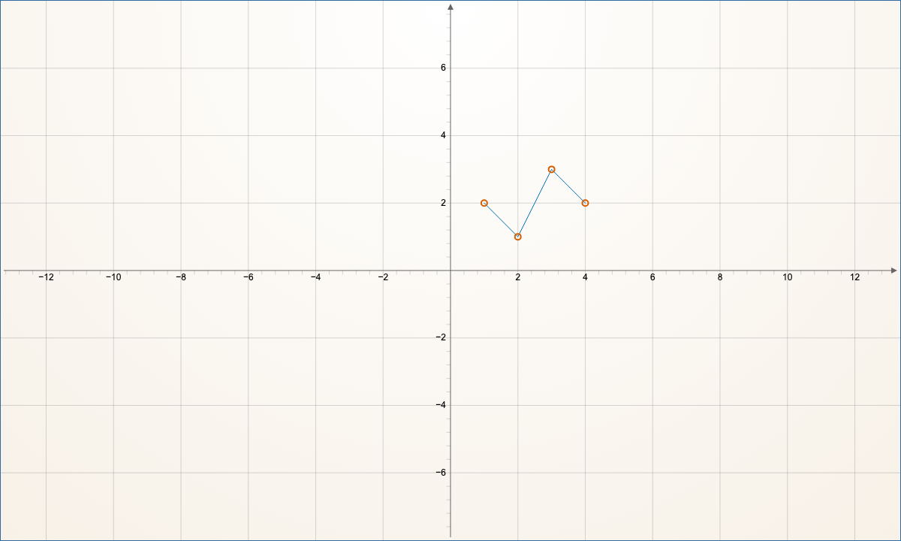</td>
    </tr>
    <tr>
      <td><code>checkbox</code></td>
      <td>往画板里塞一个勾选框。</td>
      <td style="width:260px;"><pre style="margin:0; white-space:pre-wrap; word-break:break-word; overflow-wrap:anywhere; font-size:12px;"><code>board.create(&#x27;checkbox&#x27;, [-7, 6, &#x27;显示辅助线&#x27;]);</code></pre></td>
      <td>创建 HTML 复选框控件。</td>
      <td><strong>一致</strong></td>
      <td>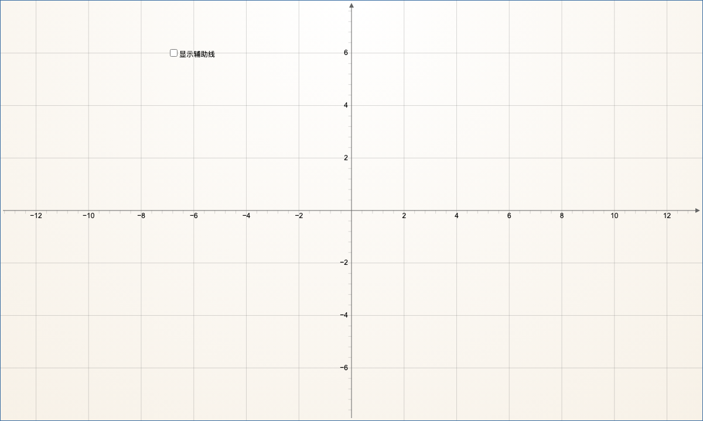</td>
    </tr>
    <tr>
      <td><code>circle</code></td>
      <td>圆心 + 半径/点/线/圆</td>
      <td style="width:260px;"><pre style="margin:0; white-space:pre-wrap; word-break:break-word; overflow-wrap:anywhere; font-size:12px;"><code>board.create(&#x27;circle&#x27;, [A, B]);</code></pre></td>
      <td>创建二维圆，半径可以来自数值、点距、线长或另一个圆。</td>
      <td><strong>一致</strong></td>
      <td>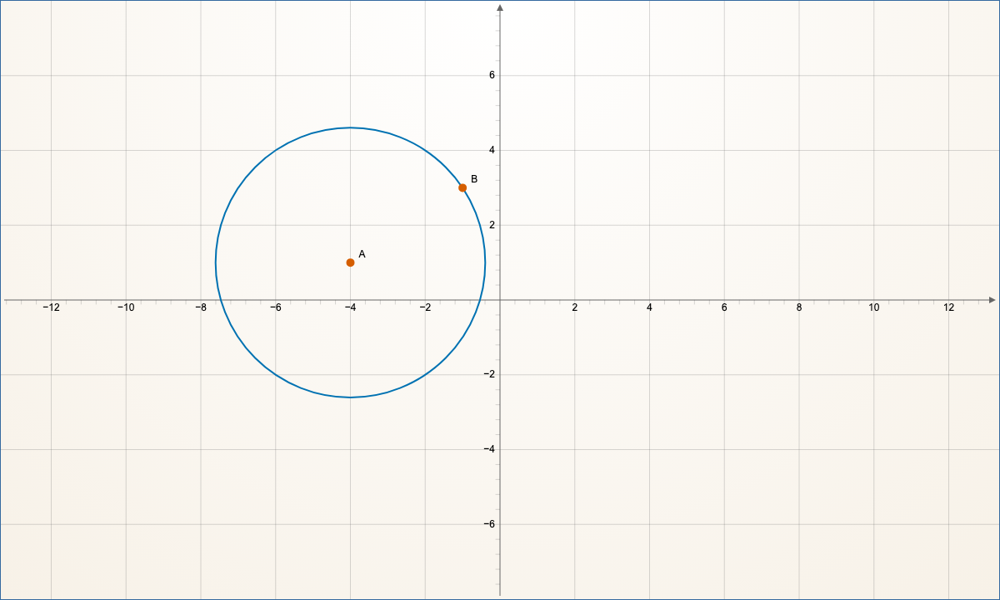</td>
    </tr>
    <tr>
      <td><code>circle3d</code></td>
      <td>在 3D 空间里画一个圆。</td>
      <td style="width:260px;"><pre style="margin:0; white-space:pre-wrap; word-break:break-word; overflow-wrap:anywhere; font-size:12px;"><code>view.create(&#x27;circle3d&#x27;, [Q5, [1, 1, 1], 1.4], { strokeColor: &#x27;#ef4444&#x27;, strokeWidth: 3 });</code></pre></td>
      <td>创建三维圆。</td>
      <td><strong>一致</strong></td>
      <td>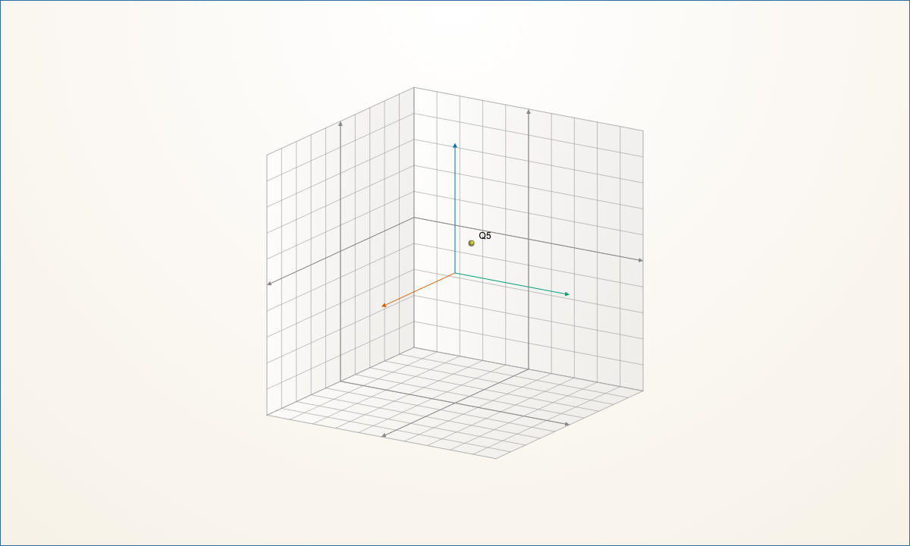</td>
    </tr>
    <tr>
      <td><code>circumcenter</code></td>
      <td>直接找三角形的外心。</td>
      <td style="width:260px;"><pre style="margin:0; white-space:pre-wrap; word-break:break-word; overflow-wrap:anywhere; font-size:12px;"><code>board.create(&#x27;circumcenter&#x27;, [A, B, C]);</code></pre></td>
      <td>创建三角形的外心，不额外创建外接圆本体。</td>
      <td><strong>一致</strong></td>
      <td></td>
    </tr>
    <tr>
      <td><code>circumcircle</code></td>
      <td>让一个圆刚好穿过三个点。</td>
      <td style="width:260px;"><pre style="margin:0; white-space:pre-wrap; word-break:break-word; overflow-wrap:anywhere; font-size:12px;"><code>board.create(&#x27;circumcircle&#x27;, [A, B, C]);</code></pre></td>
      <td>创建经过三点的外接圆。</td>
      <td><strong>一致</strong></td>
      <td>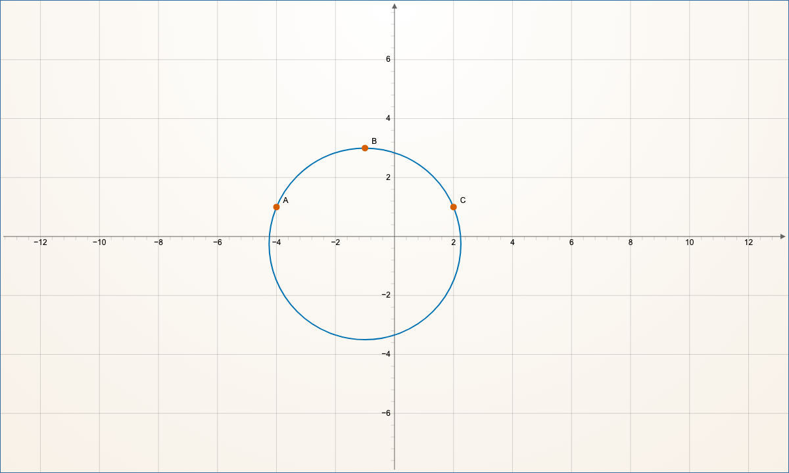</td>
    </tr>
    <tr>
      <td><code>circumcirclearc</code></td>
      <td>先确定外接圆，再只取其中一段弧。</td>
      <td style="width:260px;"><pre style="margin:0; white-space:pre-wrap; word-break:break-word; overflow-wrap:anywhere; font-size:12px;"><code>board.create(&#x27;circumcirclearc&#x27;, [A, B, C]);</code></pre></td>
      <td>创建三点外接圆上的圆弧。</td>
      <td><strong>部分一致</strong></td>
      <td>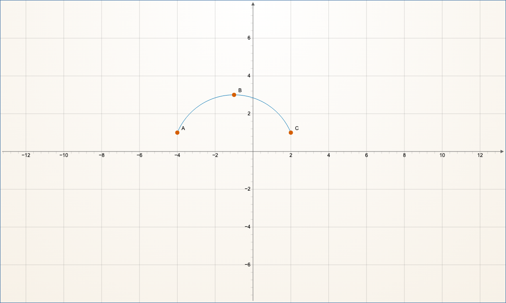</td>
    </tr>
    <tr>
      <td><code>circumcirclemidpoint</code></td>
      <td>其实就是外心，名字比较历史包袱。</td>
      <td style="width:260px;"><pre style="margin:0; white-space:pre-wrap; word-break:break-word; overflow-wrap:anywhere; font-size:12px;"><code>board.create(&#x27;circumcirclemidpoint&#x27;, [A, B, C]);</code></pre></td>
      <td>`circumcenter` 的别名，用于取得三角形外心。</td>
      <td><strong>部分一致</strong></td>
      <td>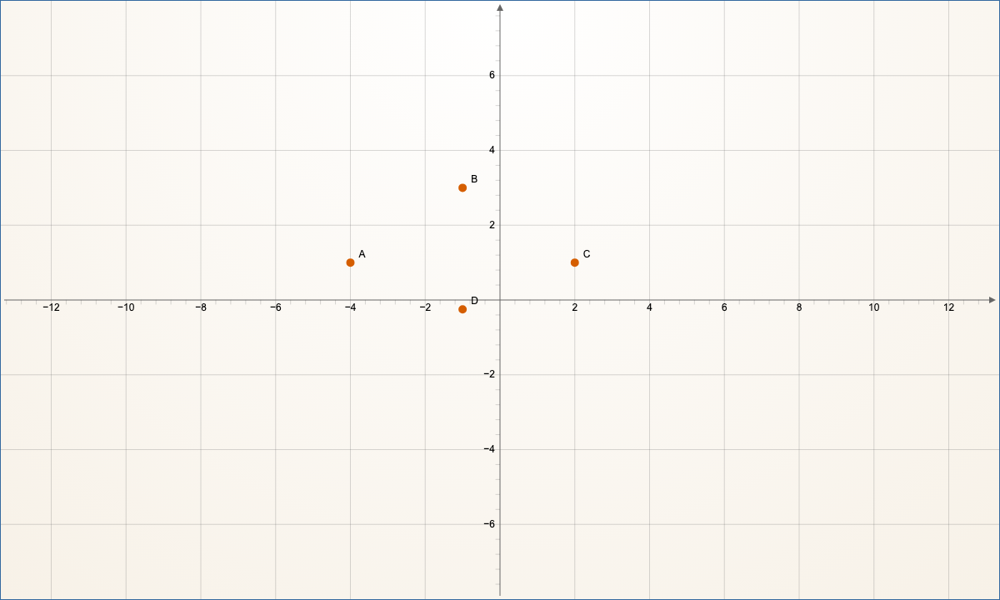</td>
    </tr>
    <tr>
      <td><code>circumcirclesector</code></td>
      <td>先确定外接圆，再取其中一块扇形。</td>
      <td style="width:260px;"><pre style="margin:0; white-space:pre-wrap; word-break:break-word; overflow-wrap:anywhere; font-size:12px;"><code>board.create(&#x27;circumcirclesector&#x27;, [A, B, C]);</code></pre></td>
      <td>创建三点外接圆上的扇形区域。</td>
      <td><strong>部分一致</strong></td>
      <td>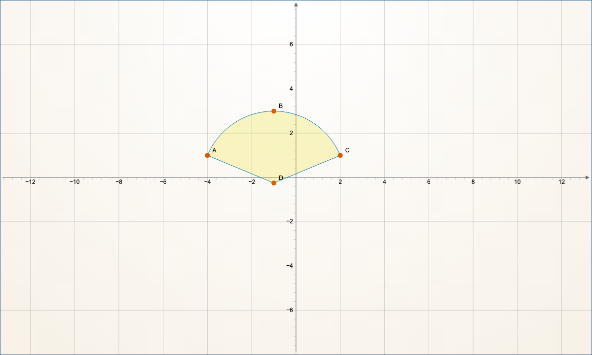</td>
    </tr>
    <tr>
      <td><code>comb</code></td>
      <td>在线段边上加一排小梳齿标记。</td>
      <td style="width:260px;"><pre style="margin:0; white-space:pre-wrap; word-break:break-word; overflow-wrap:anywhere; font-size:12px;"><code>board.create(&#x27;comb&#x27;, [A, B]);</code></pre></td>
      <td>创建梳齿状标记，常用于不等式边界或特殊线段标示。</td>
      <td><strong>不一致</strong></td>
      <td>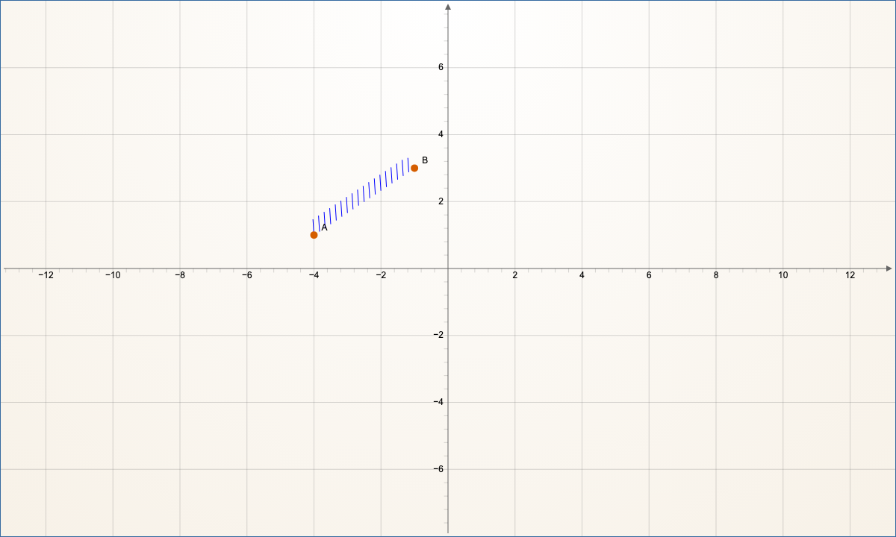</td>
    </tr>
    <tr>
      <td><code>conic</code></td>
      <td>通用二次曲线，椭圆抛物线双曲线都能装进去。</td>
      <td style="width:260px;"><pre style="margin:0; white-space:pre-wrap; word-break:break-word; overflow-wrap:anywhere; font-size:12px;"><code>board.create(&#x27;conic&#x27;, [A, B, C, D, E]);</code></pre></td>
      <td>创建一般二次曲线，可表示椭圆、抛物线、双曲线等。</td>
      <td><strong>一致</strong></td>
      <td>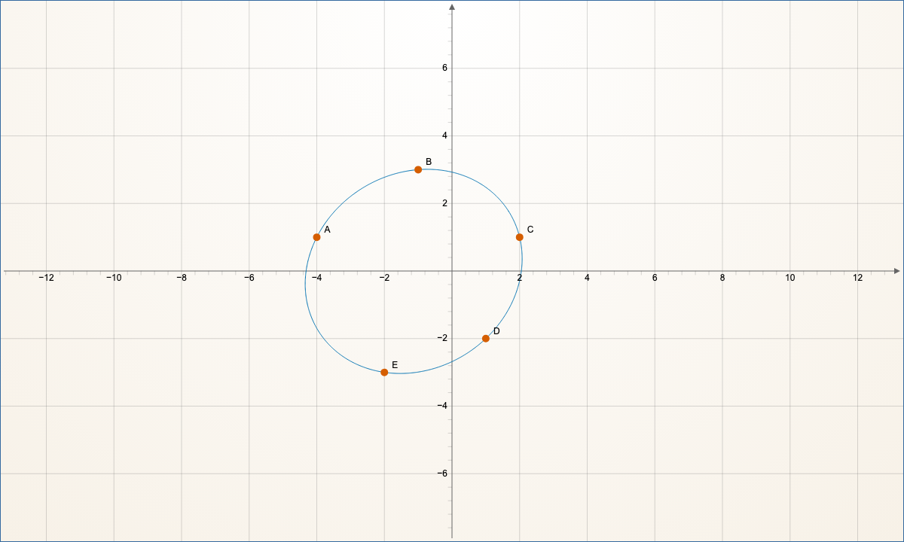</td>
    </tr>
    <tr>
      <td><code>curve</code></td>
      <td>画一条普通 2D 曲线。</td>
      <td style="width:260px;"><pre style="margin:0; white-space:pre-wrap; word-break:break-word; overflow-wrap:anywhere; font-size:12px;"><code>board.create(&#x27;curve&#x27;, [t =&gt; Math.cos(t), t =&gt; Math.sin(t), 0, 2 * Math.PI]);</code></pre></td>
      <td>创建二维参数曲线或离散点曲线。</td>
      <td><strong>一致</strong></td>
      <td>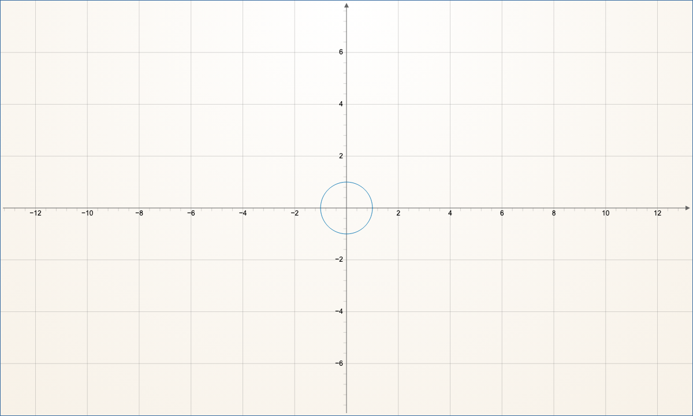</td>
    </tr>
    <tr>
      <td><code>curve3d</code></td>
      <td>画一条空间里的 3D 曲线。</td>
      <td style="width:260px;"><pre style="margin:0; white-space:pre-wrap; word-break:break-word; overflow-wrap:anywhere; font-size:12px;"><code>view.create(&#x27;curve3d&#x27;, [u =&gt; Math.cos(u), u =&gt; Math.sin(u), u =&gt; u / 3, [0, 6 * Math.PI]]);</code></pre></td>
      <td>创建三维参数曲线或三维离散曲线。</td>
      <td><strong>部分一致</strong></td>
      <td>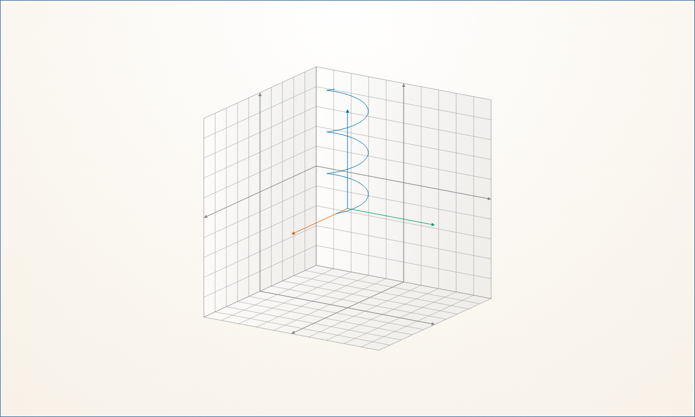</td>
    </tr>
    <tr>
      <td><code>curvedifference</code></td>
      <td>两个闭合曲线/圆/多边形</td>
      <td style="width:260px;"><pre style="margin:0; white-space:pre-wrap; word-break:break-word; overflow-wrap:anywhere; font-size:12px;"><code>board.create(&#x27;curvedifference&#x27;, [poly1, poly2], { fillColor: &#x27;#f97316&#x27;, fillOpacity: 0.2 });</code></pre></td>
      <td>创建两个封闭图形做差后的边界路径。</td>
      <td><strong>部分一致</strong></td>
      <td>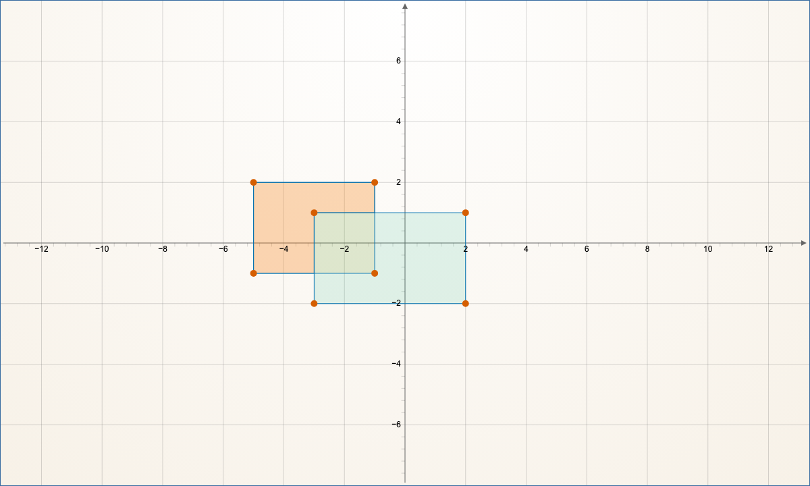</td>
    </tr>
    <tr>
      <td><code>curveintersection</code></td>
      <td>两个闭合曲线/圆/多边形</td>
      <td style="width:260px;"><pre style="margin:0; white-space:pre-wrap; word-break:break-word; overflow-wrap:anywhere; font-size:12px;"><code>board.create(&#x27;curveintersection&#x27;, [poly1, poly2], { fillColor: &#x27;#22c55e&#x27;, fillOpacity: 0.2 });</code></pre></td>
      <td>创建两个封闭图形相交后的边界路径。</td>
      <td><strong>部分一致</strong></td>
      <td>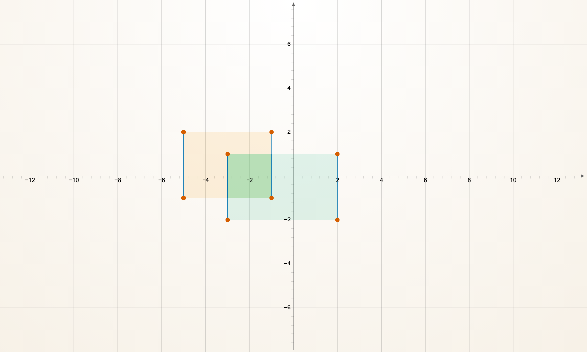</td>
    </tr>
    <tr>
      <td><code>curveunion</code></td>
      <td>两个闭合曲线/圆/多边形</td>
      <td style="width:260px;"><pre style="margin:0; white-space:pre-wrap; word-break:break-word; overflow-wrap:anywhere; font-size:12px;"><code>board.create(&#x27;curveunion&#x27;, [poly1, poly2], { fillColor: &#x27;#3b82f6&#x27;, fillOpacity: 0.2 });</code></pre></td>
      <td>创建两个封闭图形并集后的边界路径。</td>
      <td><strong>部分一致</strong></td>
      <td>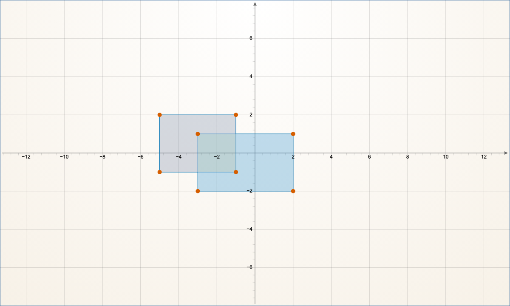</td>
    </tr>
    <tr>
      <td><code>derivative</code></td>
      <td>直接把一条函数的导函数也画出来。</td>
      <td style="width:260px;"><pre style="margin:0; white-space:pre-wrap; word-break:break-word; overflow-wrap:anywhere; font-size:12px;"><code>board.create(&#x27;derivative&#x27;, [fg]);</code></pre></td>
      <td>创建某条曲线的导函数图像。</td>
      <td><strong>一致</strong></td>
      <td>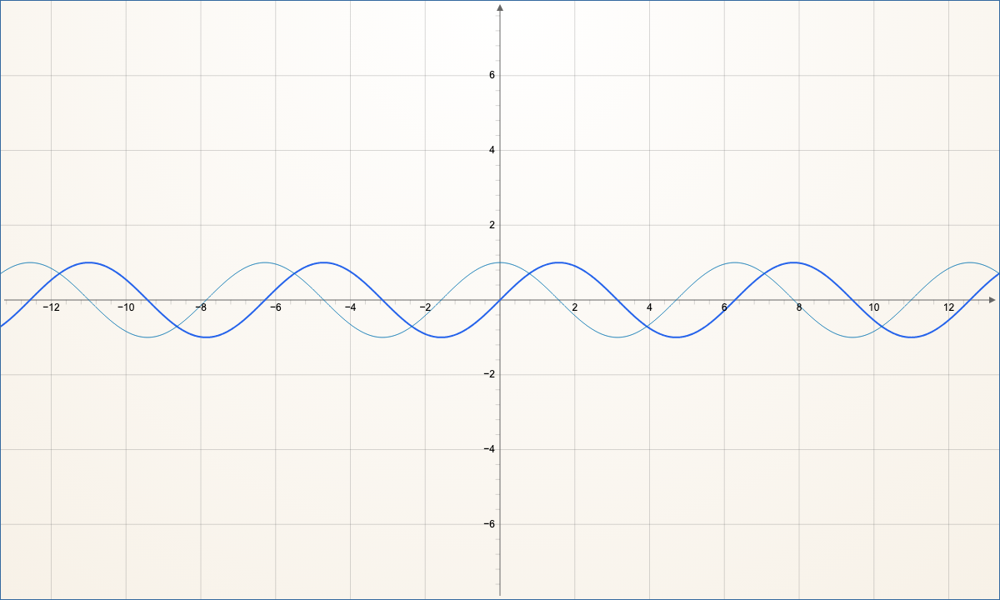</td>
    </tr>
    <tr>
      <td><code>ellipse</code></td>
      <td>画椭圆。</td>
      <td style="width:260px;"><pre style="margin:0; white-space:pre-wrap; word-break:break-word; overflow-wrap:anywhere; font-size:12px;"><code>board.create(&#x27;ellipse&#x27;, [A, B, C]);</code></pre></td>
      <td>创建椭圆。</td>
      <td><strong>一致</strong></td>
      <td>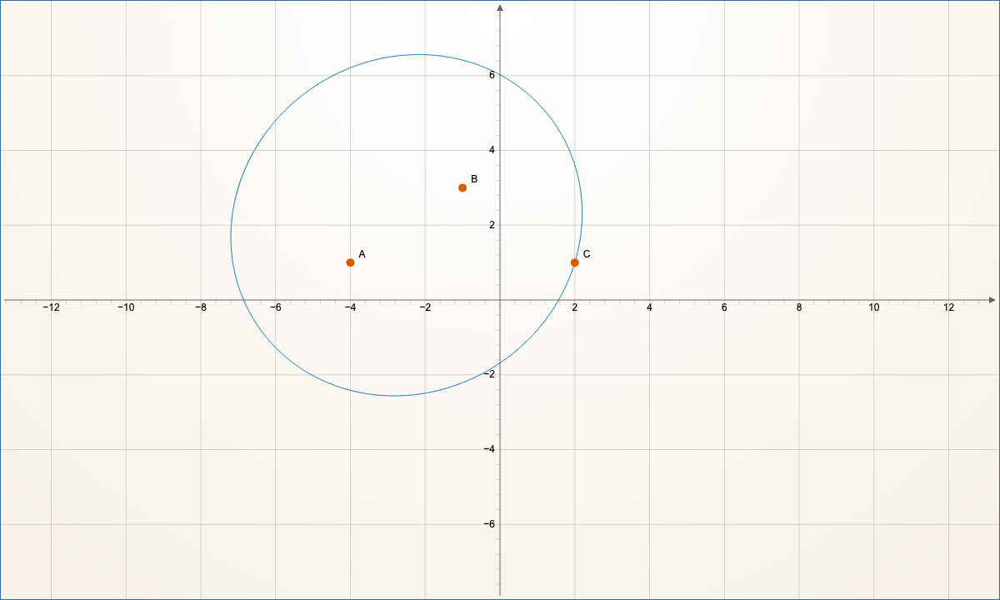</td>
    </tr>
    <tr>
      <td><code>face3d</code></td>
      <td>画 3D 物体的一个面片。</td>
      <td style="width:260px;"><pre style="margin:0; white-space:pre-wrap; word-break:break-word; overflow-wrap:anywhere; font-size:12px;"><code>const solid = view.create(&#x27;polyhedron3d&#x27;, [[[0,0,0],[2,0,0],[0,2,0],[0,0,2]], [[0,1,2],[0,1,3],[0,2,3],[1,2,3]]], { fillOpacity: 0.08, edges: { strokeColor: &#x27;#94a3b8&#x27; } }); solid.faces[0].setAttribute({ fillColor: &#x27;#f97316&#x27;, fillOpacity: 0.5, strokeWidth: 2 });</code></pre></td>
      <td>创建三维面片，常作为 3D 实体的一个面使用。</td>
      <td><strong>不一致</strong></td>
      <td>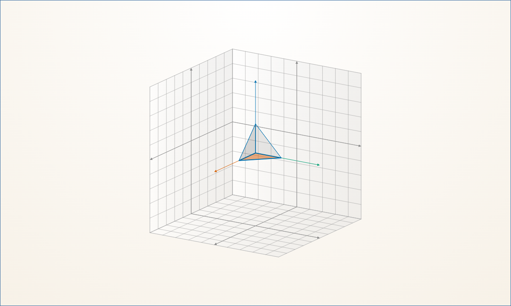</td>
    </tr>
    <tr>
      <td><code>fo</code></td>
      <td>就是 foreignobject 的短名字。</td>
      <td style="width:260px;"><pre style="margin:0; white-space:pre-wrap; word-break:break-word; overflow-wrap:anywhere; font-size:12px;"><code>board.create(&#x27;fo&#x27;, [&#x27;&lt;div style=\&quot;padding:6px\&quot;&gt;FO&lt;/div&gt;&#x27;, [-7, -1], [2.2, 1.2]]);</code></pre></td>
      <td>`foreignobject` 的别名。</td>
      <td><strong>不一致</strong></td>
      <td>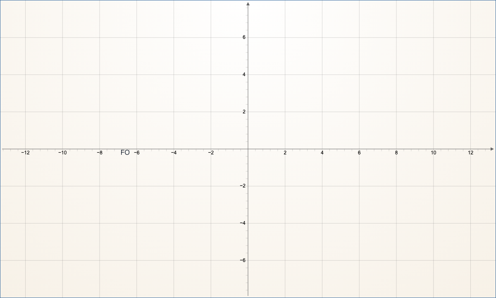</td>
    </tr>
    <tr>
      <td><code>foreignobject</code></td>
      <td>HTML 内容 + 位置 + 尺寸</td>
      <td style="width:260px;"><pre style="margin:0; white-space:pre-wrap; word-break:break-word; overflow-wrap:anywhere; font-size:12px;"><code>board.create(&#x27;foreignobject&#x27;, [&#x27;&lt;div style=\&quot;padding:6px\&quot;&gt;Hello&lt;/div&gt;&#x27;, [-7, -1], [2.2, 1.2]]);</code></pre></td>
      <td>在 SVG 中嵌入 HTML 内容，如自定义 DOM、视频、iframe 等。</td>
      <td><strong>不一致</strong></td>
      <td>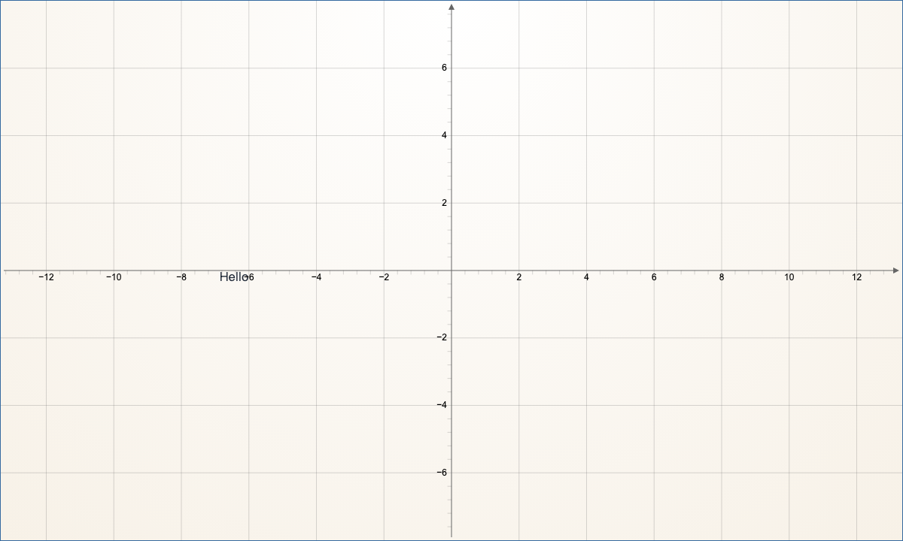</td>
    </tr>
    <tr>
      <td><code>functiongraph</code></td>
      <td>画函数图像，比如 y = sin(x)。</td>
      <td style="width:260px;"><pre style="margin:0; white-space:pre-wrap; word-break:break-word; overflow-wrap:anywhere; font-size:12px;"><code>board.create(&#x27;functiongraph&#x27;, [x =&gt; Math.sin(x)], { strokeColor: &#x27;#2563eb&#x27; });</code></pre></td>
      <td>创建二维函数图像。</td>
      <td><strong>部分一致</strong></td>
      <td>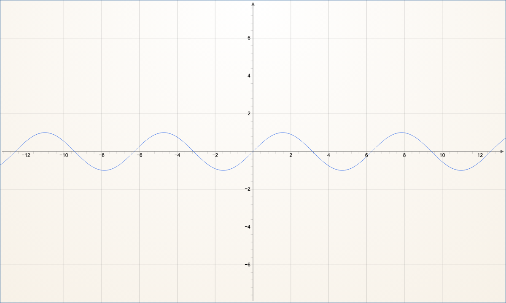</td>
    </tr>
    <tr>
      <td><code>functiongraph3d</code></td>
      <td>画曲面，比如 z = f(x, y)。</td>
      <td style="width:260px;"><pre style="margin:0; white-space:pre-wrap; word-break:break-word; overflow-wrap:anywhere; font-size:12px;"><code>view.create(&#x27;functiongraph3d&#x27;, [(x, y) =&gt; Math.sin(x) * Math.cos(y), [-3, 3], [-3, 3]]);</code></pre></td>
      <td>创建三维函数图形，通常表示 `z = f(x, y)`。</td>
      <td><strong>部分一致</strong></td>
      <td>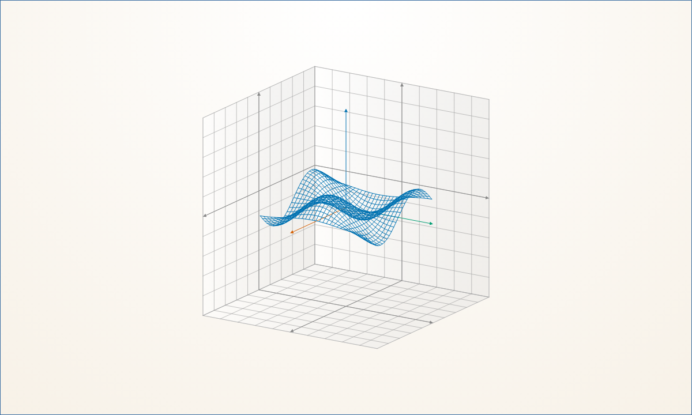</td>
    </tr>
    <tr>
      <td><code>glider</code></td>
      <td>让一个点只能沿着某条线或某条曲线滑动。</td>
      <td style="width:260px;"><pre style="margin:0; white-space:pre-wrap; word-break:break-word; overflow-wrap:anywhere; font-size:12px;"><code>board.create(&#x27;glider&#x27;, [0.5, 0.5, fg]);</code></pre></td>
      <td>创建附着在直线、圆、曲线等对象上的滑动点。</td>
      <td><strong>部分一致</strong></td>
      <td>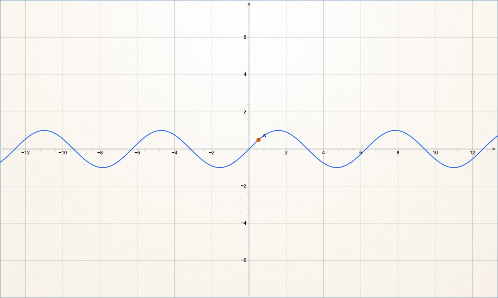</td>
    </tr>
    <tr>
      <td><code>grid</code></td>
      <td>打开网格背景。</td>
      <td style="width:260px;"><pre style="margin:0; white-space:pre-wrap; word-break:break-word; overflow-wrap:anywhere; font-size:12px;"><code>board.create(&#x27;grid&#x27;, []);</code></pre></td>
      <td>创建网格。</td>
      <td><strong>部分一致</strong></td>
      <td>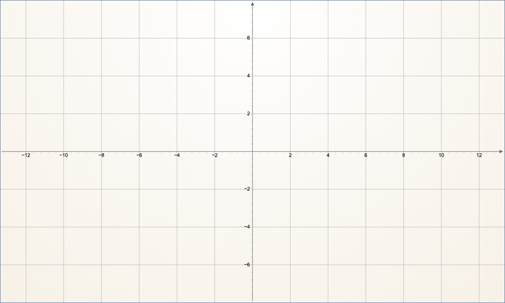</td>
    </tr>
    <tr>
      <td><code>group</code></td>
      <td>画板 + 元素数组 + 属性</td>
      <td style="width:260px;"><pre style="margin:0; white-space:pre-wrap; word-break:break-word; overflow-wrap:anywhere; font-size:12px;"><code>const group = board.create(&#x27;group&#x27;, [[A, B, C], {}]);</code></pre></td>
      <td>把多个点/文本/图像编成组，以便联动平移、缩放或旋转。</td>
      <td><strong>不一致</strong></td>
      <td></td>
    </tr>
    <tr>
      <td><code>hash</code></td>
      <td>给线段加几道小刻痕，常用来表示等长。</td>
      <td style="width:260px;"><pre style="margin:0; white-space:pre-wrap; word-break:break-word; overflow-wrap:anywhere; font-size:12px;"><code>board.create(&#x27;hash&#x27;, [lAB, 3]);</code></pre></td>
      <td>创建短刻痕标记，常用于表示线段等量。</td>
      <td><strong>不一致</strong></td>
      <td>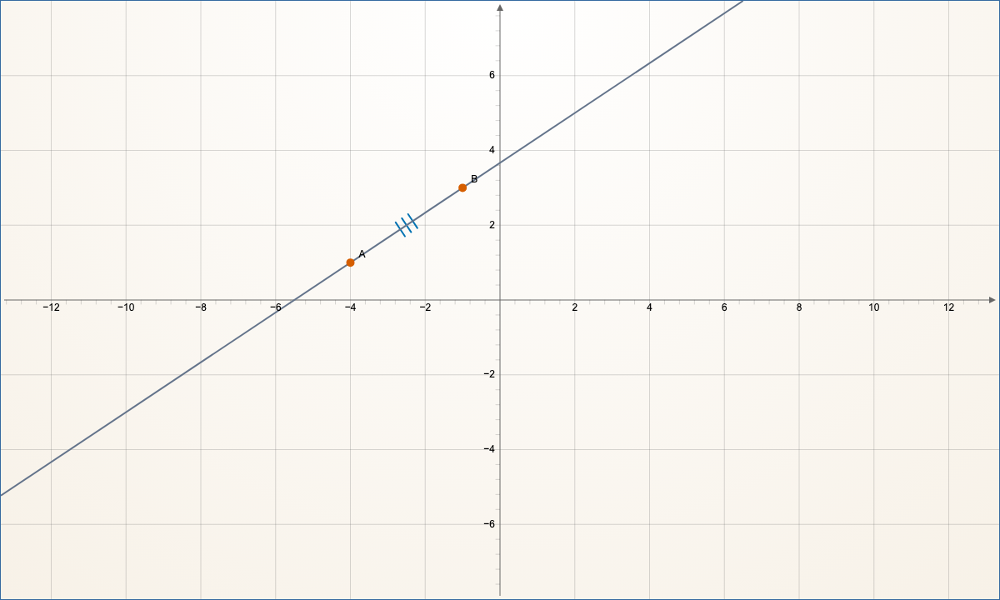</td>
    </tr>
    <tr>
      <td><code>hatch</code></td>
      <td>给对象加斜线纹或刻纹标记。</td>
      <td style="width:260px;"><pre style="margin:0; white-space:pre-wrap; word-break:break-word; overflow-wrap:anywhere; font-size:12px;"><code>board.create(&#x27;hatch&#x27;, [lAB, 4]);</code></pre></td>
      <td>创建斜线刻纹标记，和 `hash` 类似，常用于等量或区域标示。</td>
      <td><strong>不一致</strong></td>
      <td>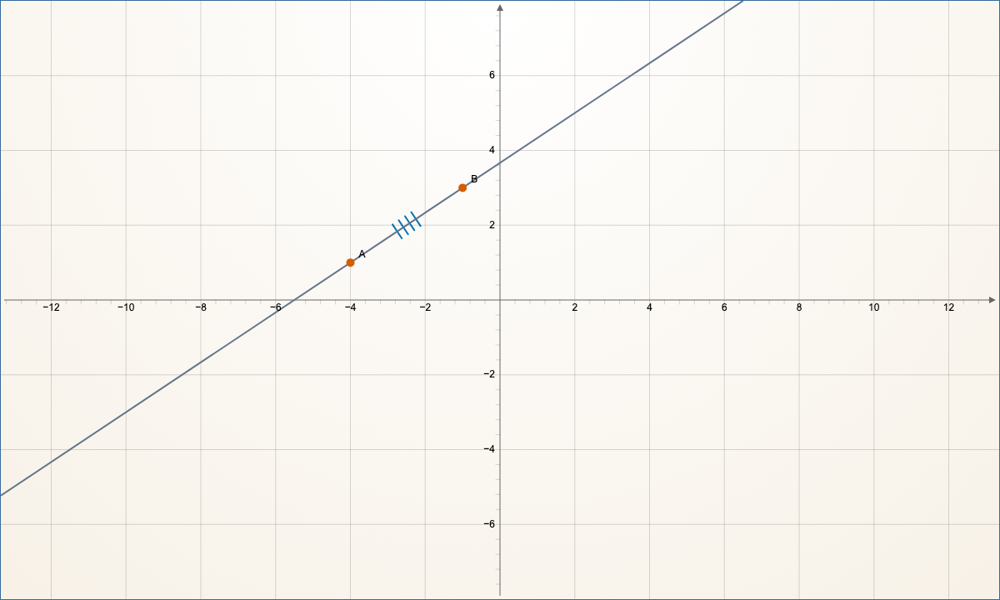</td>
    </tr>
    <tr>
      <td><code>htmlslider</code></td>
      <td>画板里的 HTML 版滑块。</td>
      <td style="width:260px;"><pre style="margin:0; white-space:pre-wrap; word-break:break-word; overflow-wrap:anywhere; font-size:12px;"><code>board.create(&#x27;htmlslider&#x27;, [[-7, 5], [0, 3, 10]]);</code></pre></td>
      <td>创建 HTML 版滑块控件。</td>
      <td><strong>不一致</strong></td>
      <td>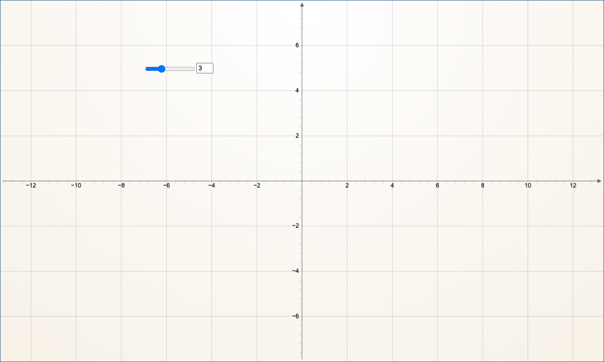</td>
    </tr>
    <tr>
      <td><code>hyperbola</code></td>
      <td>画双曲线。</td>
      <td style="width:260px;"><pre style="margin:0; white-space:pre-wrap; word-break:break-word; overflow-wrap:anywhere; font-size:12px;"><code>board.create(&#x27;hyperbola&#x27;, [A, B, C]);</code></pre></td>
      <td>创建双曲线。</td>
      <td><strong>一致</strong></td>
      <td>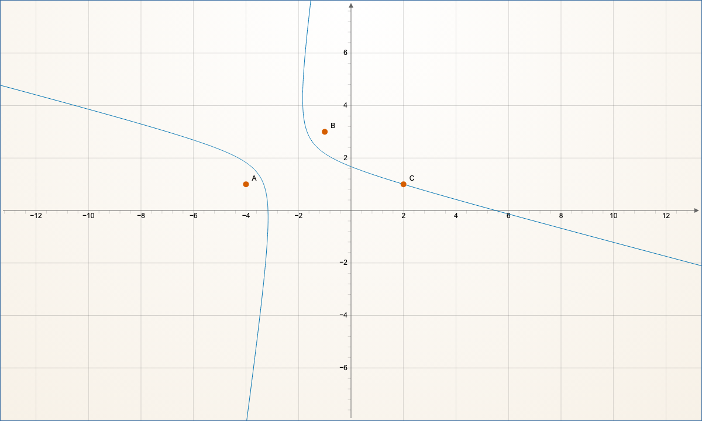</td>
    </tr>
    <tr>
      <td><code>image</code></td>
      <td>图片 URL + 位置 + 尺寸</td>
      <td style="width:260px;"><pre style="margin:0; white-space:pre-wrap; word-break:break-word; overflow-wrap:anywhere; font-size:12px;"><code>board.create(&#x27;image&#x27;, [&#x27;https://dummyimage.com/120x80/e5e7eb/111827&amp;text=img&#x27;, [-7, -4], [3, 2]]);</code></pre></td>
      <td>在画板中插入图片。</td>
      <td><strong>一致</strong></td>
      <td>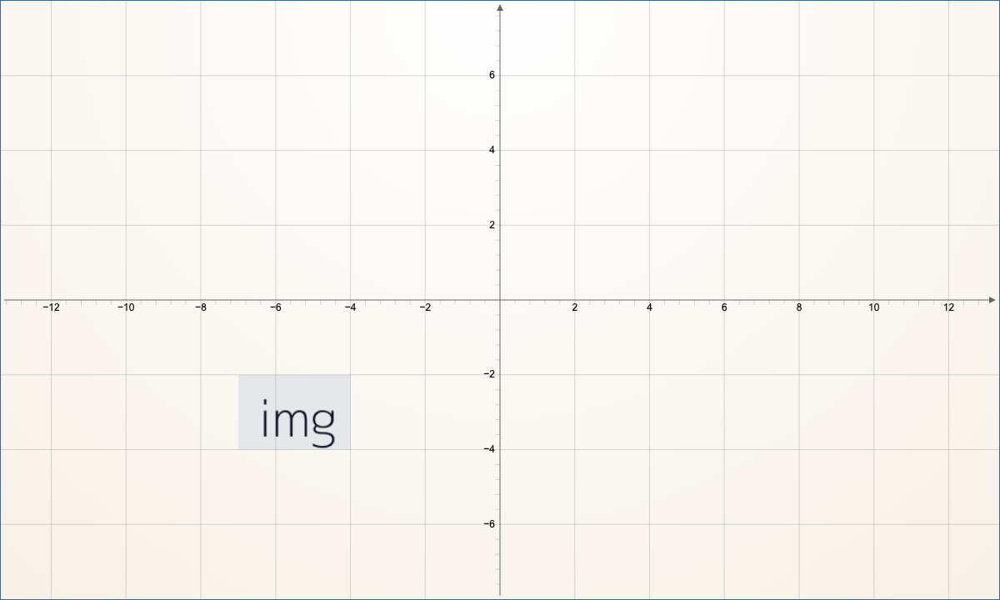</td>
    </tr>
    <tr>
      <td><code>implicitcurve</code></td>
      <td>直接按方程画隐式曲线，不用先写成 y = f(x)。</td>
      <td style="width:260px;"><pre style="margin:0; white-space:pre-wrap; word-break:break-word; overflow-wrap:anywhere; font-size:12px;"><code>board.create(&#x27;implicitcurve&#x27;, [&#x27;x^2 + y^2 - 9&#x27;]);</code></pre></td>
      <td>创建隐式曲线，例如 `x^2 + y^2 - 1 = 0`。</td>
      <td><strong>一致</strong></td>
      <td>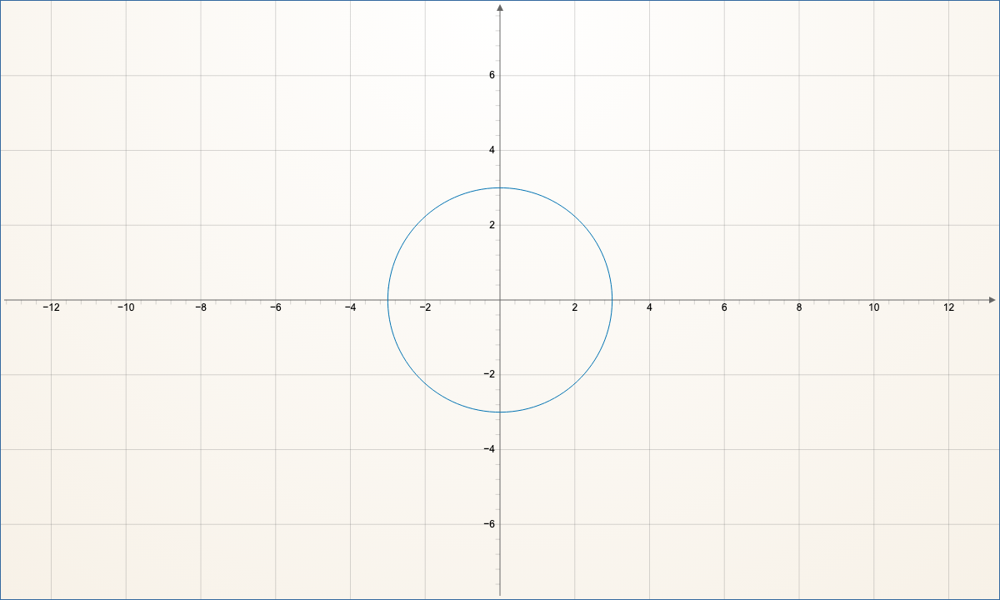</td>
    </tr>
    <tr>
      <td><code>incenter</code></td>
      <td>直接找三角形的内心。</td>
      <td style="width:260px;"><pre style="margin:0; white-space:pre-wrap; word-break:break-word; overflow-wrap:anywhere; font-size:12px;"><code>board.create(&#x27;incenter&#x27;, [A, B, C]);</code></pre></td>
      <td>创建三角形内心。</td>
      <td><strong>一致</strong></td>
      <td>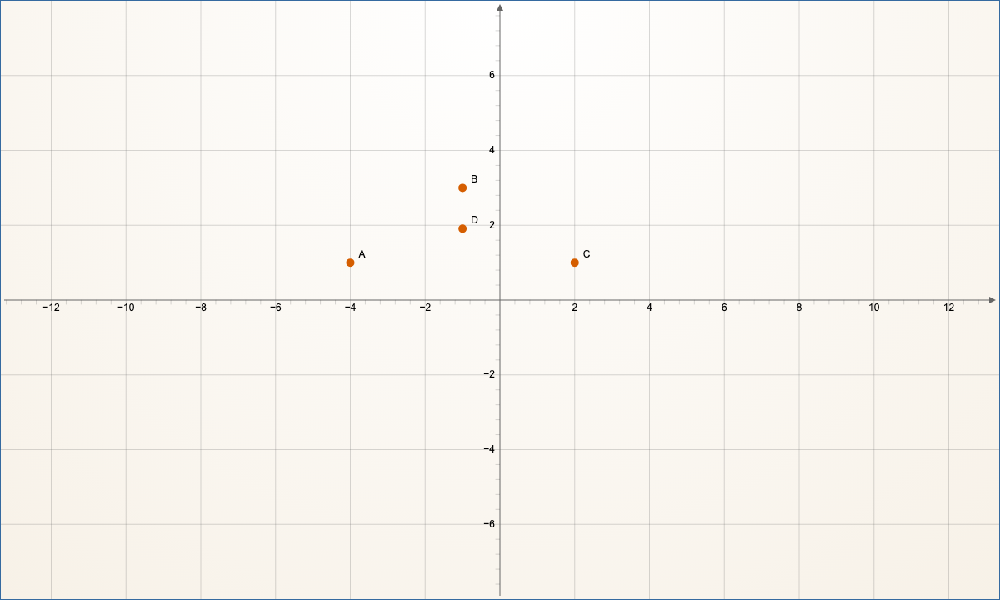</td>
    </tr>
    <tr>
      <td><code>incircle</code></td>
      <td>画三角形的内切圆。</td>
      <td style="width:260px;"><pre style="margin:0; white-space:pre-wrap; word-break:break-word; overflow-wrap:anywhere; font-size:12px;"><code>board.create(&#x27;incircle&#x27;, [A, B, C]);</code></pre></td>
      <td>创建三角形内切圆。</td>
      <td><strong>一致</strong></td>
      <td>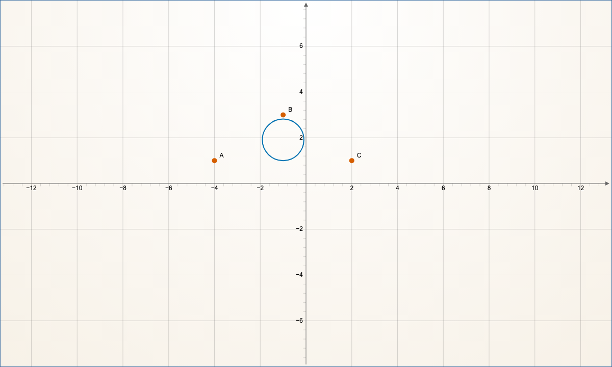</td>
    </tr>
    <tr>
      <td><code>inequality</code></td>
      <td>直线或函数图像</td>
      <td style="width:260px;"><pre style="margin:0; white-space:pre-wrap; word-break:break-word; overflow-wrap:anywhere; font-size:12px;"><code>board.create(&#x27;inequality&#x27;, [fg], { inverse: false, fillOpacity: 0.15 });</code></pre></td>
      <td>创建不等式区域，如某条线下方或函数图像某侧区域。</td>
      <td><strong>部分一致</strong></td>
      <td>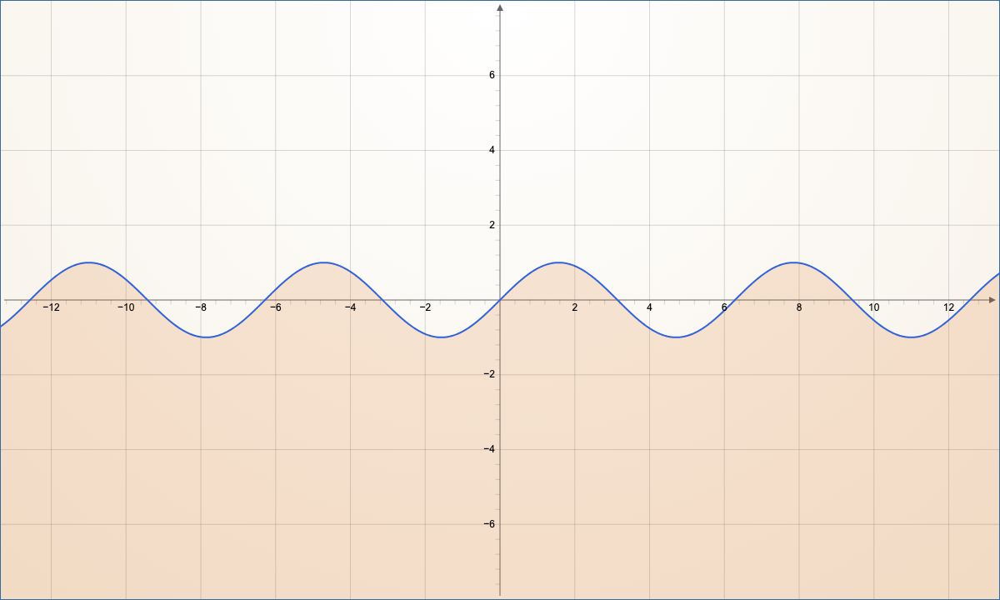</td>
    </tr>
    <tr>
      <td><code>input</code></td>
      <td>往画板里塞一个输入框。</td>
      <td style="width:260px;"><pre style="margin:0; white-space:pre-wrap; word-break:break-word; overflow-wrap:anywhere; font-size:12px;"><code>board.create(&#x27;input&#x27;, [-7, 4, &#x27;sin(x)&#x27;, &#x27;f(x)=&#x27;]);</code></pre></td>
      <td>创建 HTML 文本输入框。</td>
      <td><strong>部分一致</strong></td>
      <td>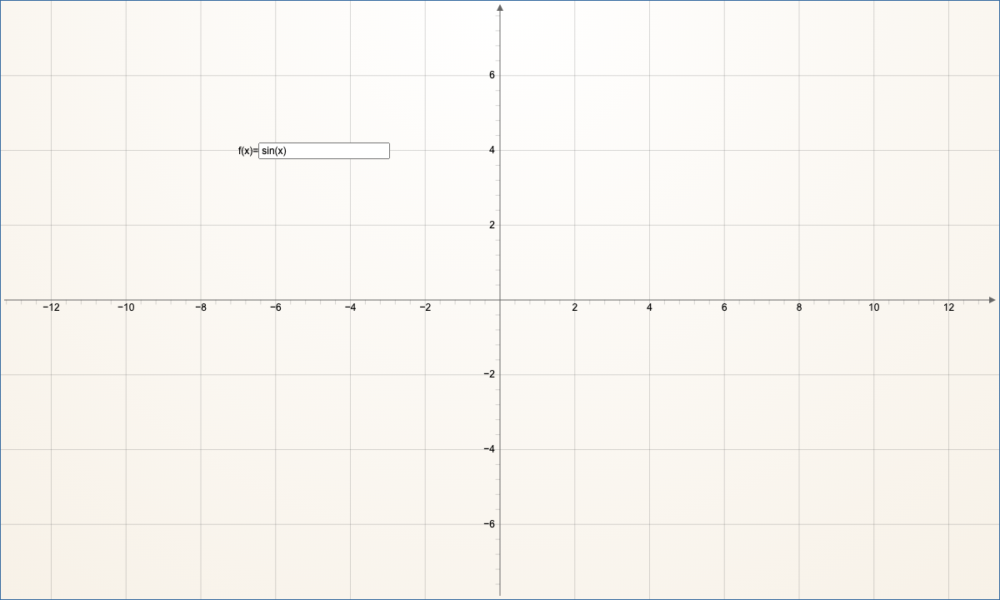</td>
    </tr>
    <tr>
      <td><code>integral</code></td>
      <td>区间 + 曲线</td>
      <td style="width:260px;"><pre style="margin:0; white-space:pre-wrap; word-break:break-word; overflow-wrap:anywhere; font-size:12px;"><code>board.create(&#x27;integral&#x27;, [[-2, 2], fg]);</code></pre></td>
      <td>创建积分区域或积分相关图形。</td>
      <td><strong>一致</strong></td>
      <td>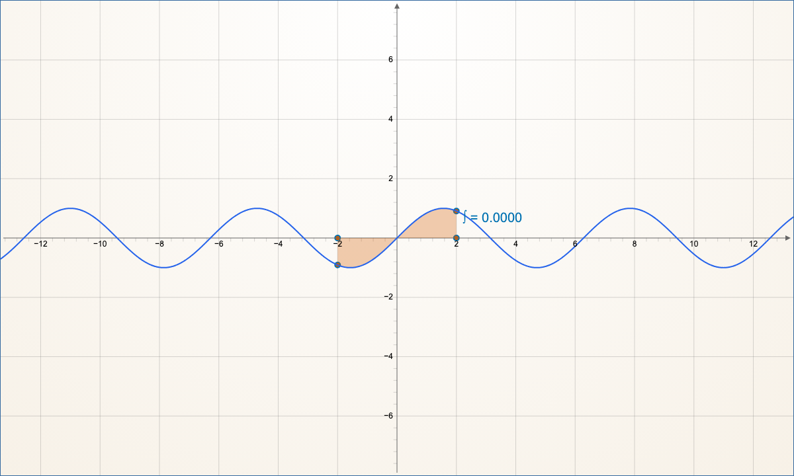</td>
    </tr>
    <tr>
      <td><code>intersection</code></td>
      <td>两个对象 + 交点索引</td>
      <td style="width:260px;"><pre style="margin:0; white-space:pre-wrap; word-break:break-word; overflow-wrap:anywhere; font-size:12px;"><code>board.create(&#x27;intersection&#x27;, [c1, c2, 0]);</code></pre></td>
      <td>创建两个对象的交点。</td>
      <td><strong>一致</strong></td>
      <td>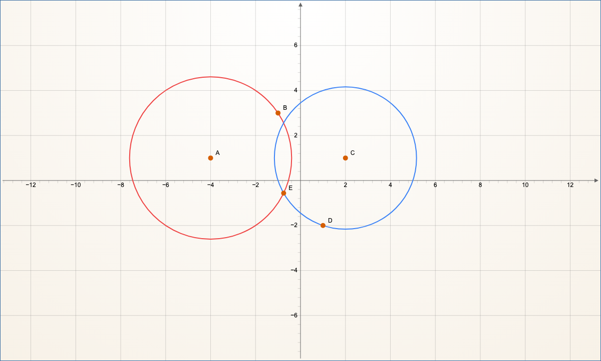</td>
    </tr>
    <tr>
      <td><code>intersectioncircle3d</code></td>
      <td>球与球/平面</td>
      <td style="width:260px;"><pre style="margin:0; white-space:pre-wrap; word-break:break-word; overflow-wrap:anywhere; font-size:12px;"><code>view.create(&#x27;intersectioncircle3d&#x27;, [sphereA, planeA]);</code></pre></td>
      <td>创建 3D 对象相交得到的圆。</td>
      <td><strong>部分一致</strong></td>
      <td>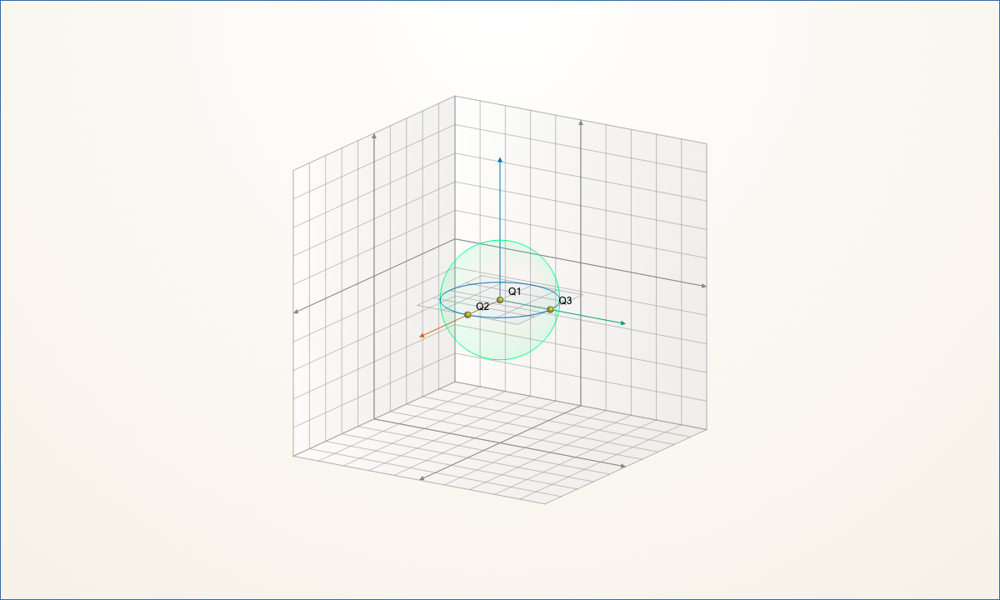</td>
    </tr>
    <tr>
      <td><code>intersectionline3d</code></td>
      <td>两个平面</td>
      <td style="width:260px;"><pre style="margin:0; white-space:pre-wrap; word-break:break-word; overflow-wrap:anywhere; font-size:12px;"><code>view.create(&#x27;intersectionline3d&#x27;, [planeA, planeB]);</code></pre></td>
      <td>创建两个平面相交得到的直线。</td>
      <td><strong>部分一致</strong></td>
      <td>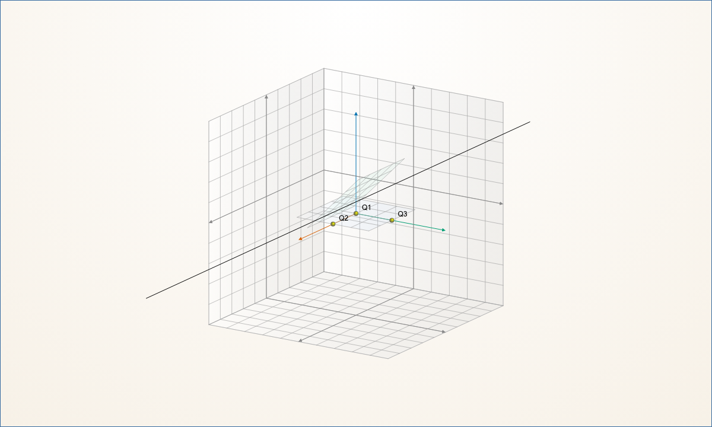</td>
    </tr>
    <tr>
      <td><code>legend</code></td>
      <td>给图表配一个图例说明。</td>
      <td style="width:260px;"><pre style="margin:0; white-space:pre-wrap; word-break:break-word; overflow-wrap:anywhere; font-size:12px;"><code>board.create(&#x27;legend&#x27;, [5.5, 7.5]);</code></pre></td>
      <td>创建图表图例。</td>
      <td><strong>部分一致</strong></td>
      <td>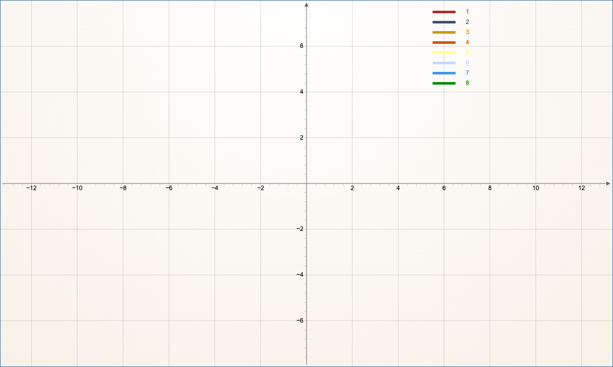</td>
    </tr>
    <tr>
      <td><code>line</code></td>
      <td>画直线。</td>
      <td style="width:260px;"><pre style="margin:0; white-space:pre-wrap; word-break:break-word; overflow-wrap:anywhere; font-size:12px;"><code>board.create(&#x27;line&#x27;, [A, B]);</code></pre></td>
      <td>创建二维直线。</td>
      <td><strong>一致</strong></td>
      <td>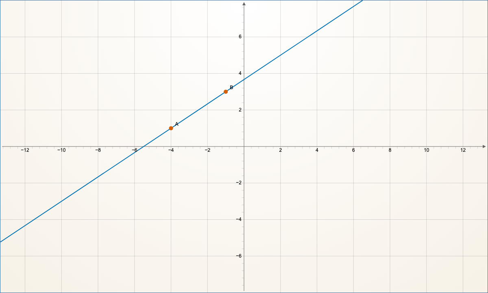</td>
    </tr>
    <tr>
      <td><code>line3d</code></td>
      <td>画空间直线。</td>
      <td style="width:260px;"><pre style="margin:0; white-space:pre-wrap; word-break:break-word; overflow-wrap:anywhere; font-size:12px;"><code>view.create(&#x27;line3d&#x27;, [[0, 0, 0], [2, 1, 1]]);</code></pre></td>
      <td>创建三维直线、射线或线段。</td>
      <td><strong>一致</strong></td>
      <td>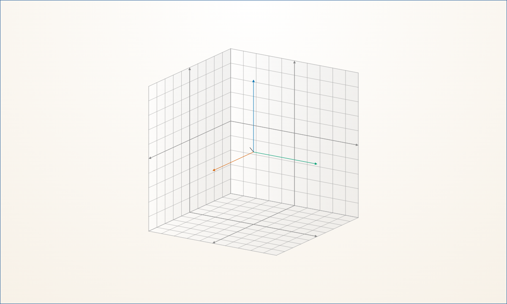</td>
    </tr>
    <tr>
      <td><code>majorarc</code></td>
      <td>取圆上比较大的那段弧。</td>
      <td style="width:260px;"><pre style="margin:0; white-space:pre-wrap; word-break:break-word; overflow-wrap:anywhere; font-size:12px;"><code>board.create(&#x27;majorarc&#x27;, [A, B, C]);</code></pre></td>
      <td>创建大圆弧（角度大于等于 180 度）。</td>
      <td><strong>部分一致</strong></td>
      <td></td>
    </tr>
    <tr>
      <td><code>majorsector</code></td>
      <td>取圆上比较大的那块扇形。</td>
      <td style="width:260px;"><pre style="margin:0; white-space:pre-wrap; word-break:break-word; overflow-wrap:anywhere; font-size:12px;"><code>board.create(&#x27;majorsector&#x27;, [A, B, C]);</code></pre></td>
      <td>创建大扇形（角度大于等于 180 度）。</td>
      <td><strong>部分一致</strong></td>
      <td>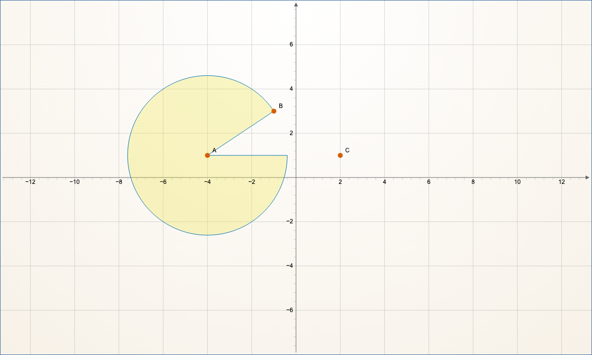</td>
    </tr>
    <tr>
      <td><code>measurement</code></td>
      <td>把长度角度面积这些测量值直接显示出来。</td>
      <td style="width:260px;"><pre style="margin:0; white-space:pre-wrap; word-break:break-word; overflow-wrap:anywhere; font-size:12px;"><code>board.create(&#x27;measurement&#x27;, [A, B, [&#x27;Dist&#x27;, &#x27;A&#x27;, &#x27;B&#x27;]]);</code></pre></td>
      <td>创建测量文本，可显示长度、角度、面积或表达式值。</td>
      <td><strong>部分一致</strong></td>
      <td>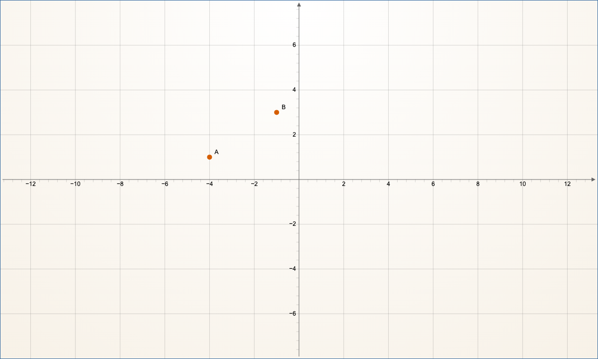</td>
    </tr>
    <tr>
      <td><code>mesh3d</code></td>
      <td>画一个 3D 网格面。</td>
      <td style="width:260px;"><pre style="margin:0; white-space:pre-wrap; word-break:break-word; overflow-wrap:anywhere; font-size:12px;"><code>view.create(&#x27;mesh3d&#x27;, [[0, 0, 0], [1, 0, 0], [0, 1, 0], [-2, 2], [-2, 2]]);</code></pre></td>
      <td>创建三维网格面。</td>
      <td><strong>不一致</strong></td>
      <td></td>
    </tr>
    <tr>
      <td><code>metapostspline</code></td>
      <td>点数组 + Metapost 控制参数</td>
      <td style="width:260px;"><pre style="margin:0; white-space:pre-wrap; word-break:break-word; overflow-wrap:anywhere; font-size:12px;"><code>board.create(&#x27;metapostspline&#x27;, [[A, B, C, D], { tension: 1 }]);</code></pre></td>
      <td>创建 Metapost 风格样条曲线。</td>
      <td><strong>不一致</strong></td>
      <td>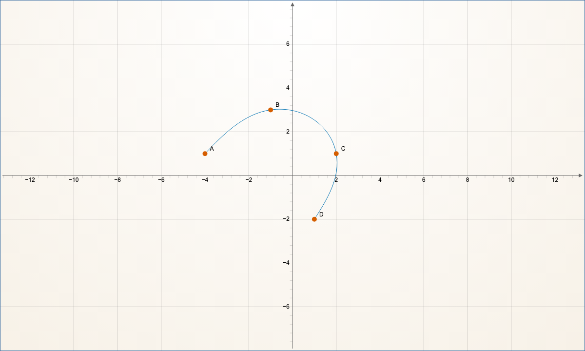</td>
    </tr>
    <tr>
      <td><code>midpoint</code></td>
      <td>找中点。</td>
      <td style="width:260px;"><pre style="margin:0; white-space:pre-wrap; word-break:break-word; overflow-wrap:anywhere; font-size:12px;"><code>board.create(&#x27;midpoint&#x27;, [A, B]);</code></pre></td>
      <td>创建中点。</td>
      <td><strong>一致</strong></td>
      <td>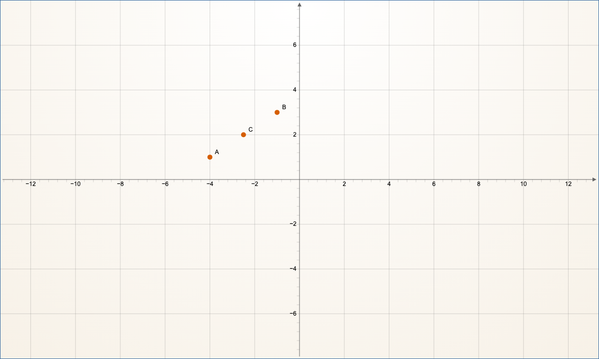</td>
    </tr>
    <tr>
      <td><code>minorarc</code></td>
      <td>取圆上比较短的那段弧。</td>
      <td style="width:260px;"><pre style="margin:0; white-space:pre-wrap; word-break:break-word; overflow-wrap:anywhere; font-size:12px;"><code>board.create(&#x27;minorarc&#x27;, [A, B, C]);</code></pre></td>
      <td>创建小圆弧（角度小于等于 180 度）。</td>
      <td><strong>部分一致</strong></td>
      <td>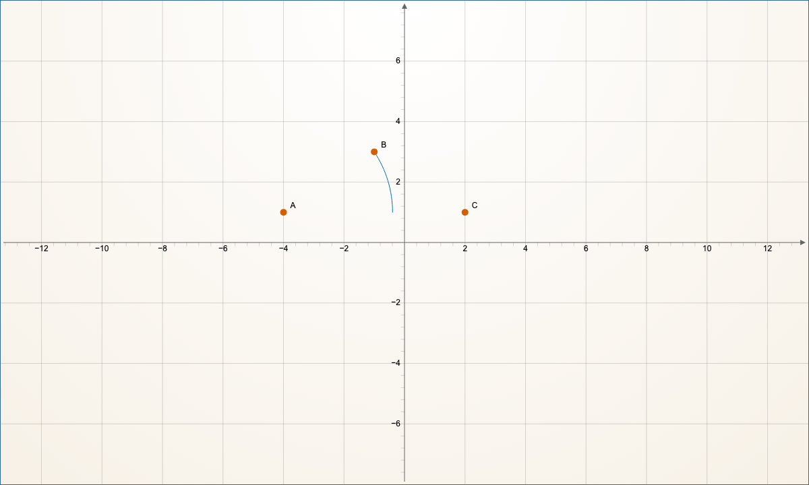</td>
    </tr>
    <tr>
      <td><code>minorsector</code></td>
      <td>取圆上比较小的那块扇形。</td>
      <td style="width:260px;"><pre style="margin:0; white-space:pre-wrap; word-break:break-word; overflow-wrap:anywhere; font-size:12px;"><code>board.create(&#x27;minorsector&#x27;, [A, B, C]);</code></pre></td>
      <td>创建小扇形（角度小于等于 180 度）。</td>
      <td><strong>部分一致</strong></td>
      <td>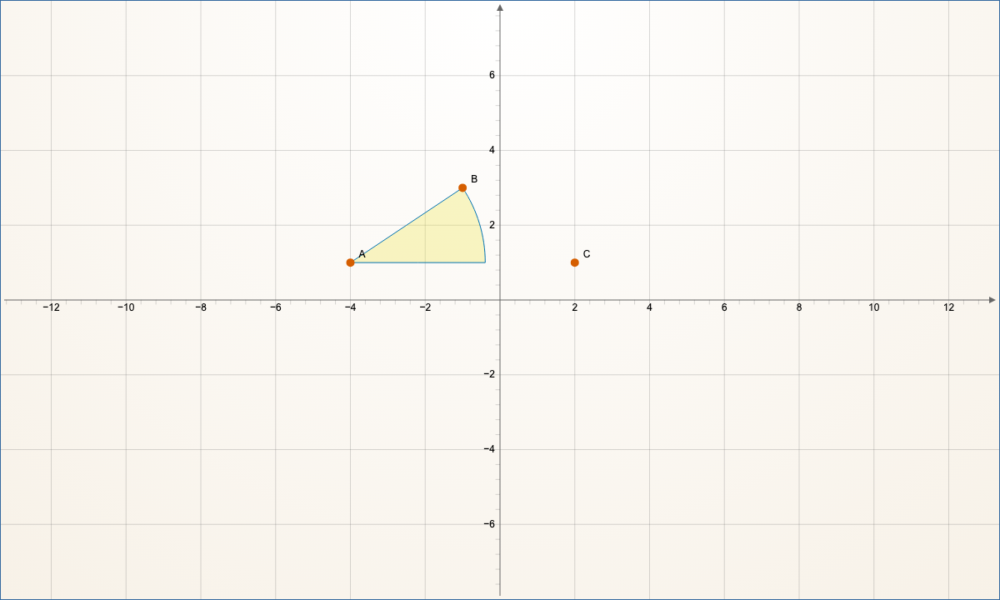</td>
    </tr>
    <tr>
      <td><code>mirrorelement</code></td>
      <td>对象 + 镜像中心点</td>
      <td style="width:260px;"><pre style="margin:0; white-space:pre-wrap; word-break:break-word; overflow-wrap:anywhere; font-size:12px;"><code>board.create(&#x27;mirrorelement&#x27;, [segAB, O]);</code></pre></td>
      <td>按点对一个图形做中心对称。</td>
      <td><strong>部分一致</strong></td>
      <td>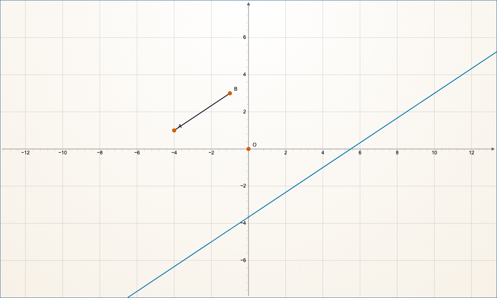</td>
    </tr>
    <tr>
      <td><code>mirrorpoint</code></td>
      <td>把一个点按另一个点翻到对面去。</td>
      <td style="width:260px;"><pre style="margin:0; white-space:pre-wrap; word-break:break-word; overflow-wrap:anywhere; font-size:12px;"><code>board.create(&#x27;mirrorpoint&#x27;, [O, A]);</code></pre></td>
      <td>把一个点按另一个点做中心对称。</td>
      <td><strong>部分一致</strong></td>
      <td>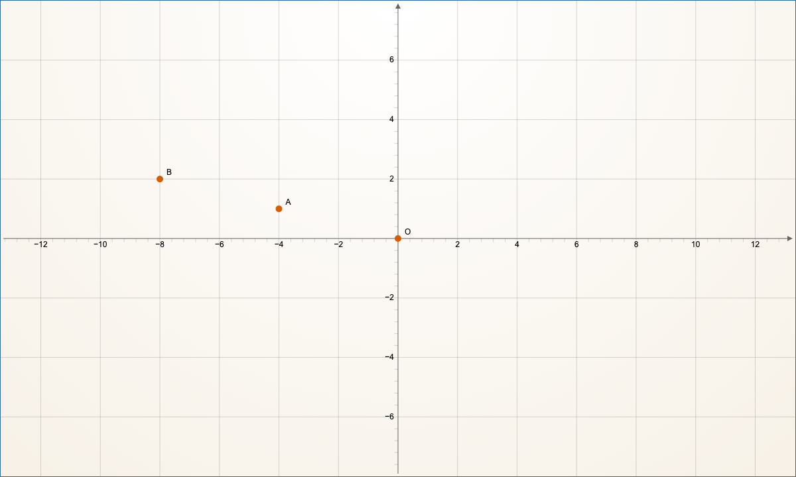</td>
    </tr>
    <tr>
      <td><code>msector</code></td>
      <td>文档不完整，通常与角/扇形测量相关</td>
      <td style="width:260px;"><pre style="margin:0; white-space:pre-wrap; word-break:break-word; overflow-wrap:anywhere; font-size:12px;"><code>board.create(&#x27;msector&#x27;, [A, B, C]); // 某些版本可能需要微调</code></pre></td>
      <td>历史/实验性元素，建议不要作为稳定公共指令依赖。</td>
      <td><strong>不一致</strong></td>
      <td>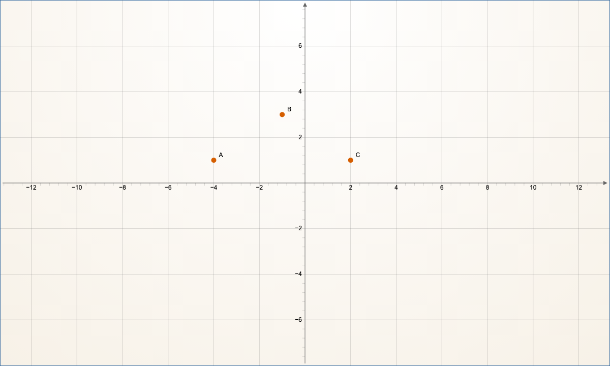</td>
    </tr>
    <tr>
      <td><code>nonreflexangle</code></td>
      <td>强制取不超过 180 度的那个角。</td>
      <td style="width:260px;"><pre style="margin:0; white-space:pre-wrap; word-break:break-word; overflow-wrap:anywhere; font-size:12px;"><code>board.create(&#x27;nonreflexangle&#x27;, [A, B, C]);</code></pre></td>
      <td>创建不大于 180 度的角对象。</td>
      <td><strong>部分一致</strong></td>
      <td>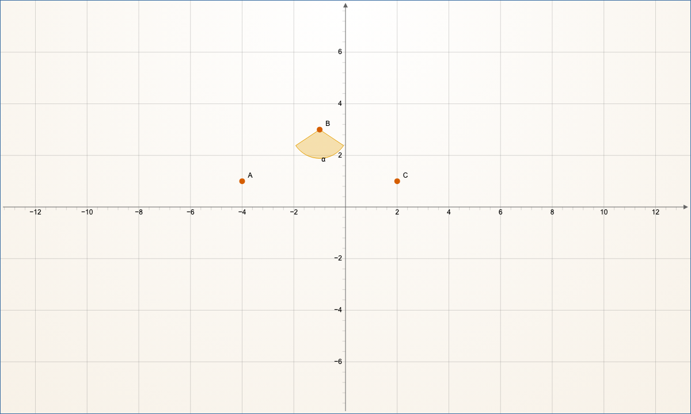</td>
    </tr>
    <tr>
      <td><code>normal</code></td>
      <td>对象 + 点</td>
      <td style="width:260px;"><pre style="margin:0; white-space:pre-wrap; word-break:break-word; overflow-wrap:anywhere; font-size:12px;"><code>board.create(&#x27;normal&#x27;, [fg, G]);</code></pre></td>
      <td>创建法线/垂线，通常相对于曲线切线或直线。</td>
      <td><strong>部分一致</strong></td>
      <td>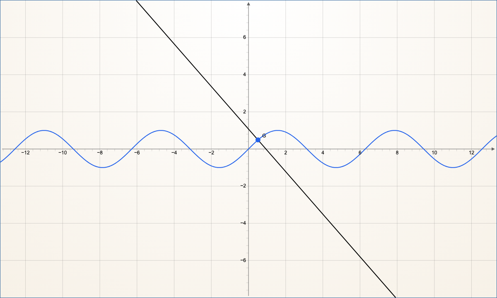</td>
    </tr>
    <tr>
      <td><code>orthogonalprojection</code></td>
      <td>把一个点垂直投到一条线上。</td>
      <td style="width:260px;"><pre style="margin:0; white-space:pre-wrap; word-break:break-word; overflow-wrap:anywhere; font-size:12px;"><code>board.create(&#x27;orthogonalprojection&#x27;, [C, lAB]);</code></pre></td>
      <td>创建点到直线的正交投影点。</td>
      <td><strong>部分一致</strong></td>
      <td>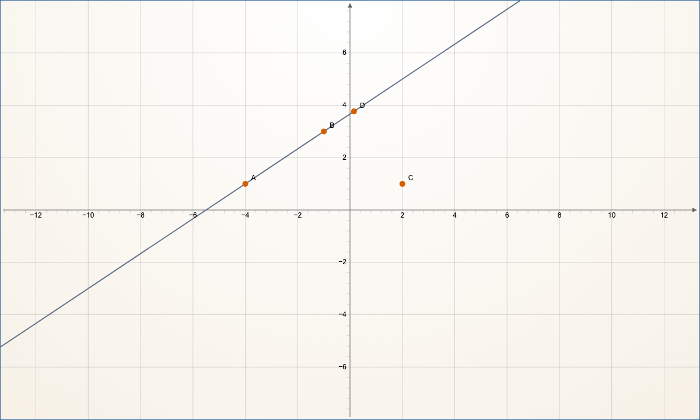</td>
    </tr>
    <tr>
      <td><code>otherintersection</code></td>
      <td>两个对象 + 已知交点</td>
      <td style="width:260px;"><pre style="margin:0; white-space:pre-wrap; word-break:break-word; overflow-wrap:anywhere; font-size:12px;"><code>board.create(&#x27;otherintersection&#x27;, [c1, c2, I0]);</code></pre></td>
      <td>在已有一个交点的情况下，创建“另一个”交点。</td>
      <td><strong>部分一致</strong></td>
      <td>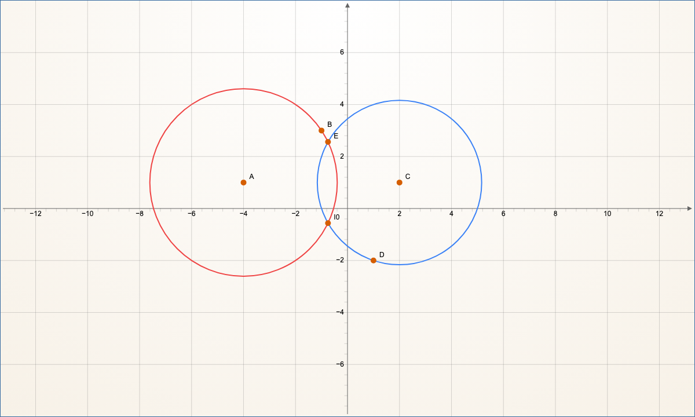</td>
    </tr>
    <tr>
      <td><code>parabola</code></td>
      <td>画抛物线。</td>
      <td style="width:260px;"><pre style="margin:0; white-space:pre-wrap; word-break:break-word; overflow-wrap:anywhere; font-size:12px;"><code>board.create(&#x27;parabola&#x27;, [A, lCD]);</code></pre></td>
      <td>创建抛物线。</td>
      <td><strong>一致</strong></td>
      <td>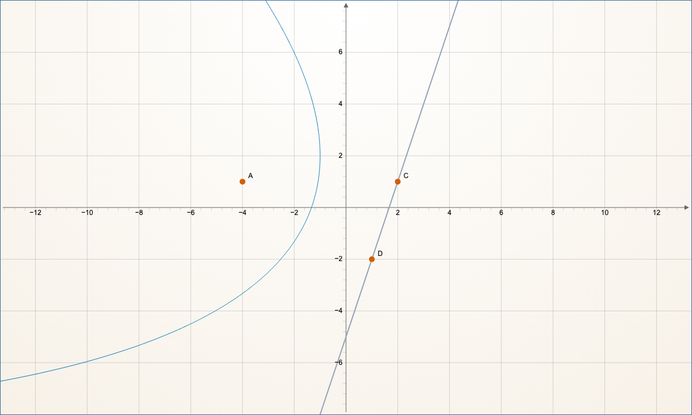</td>
    </tr>
    <tr>
      <td><code>parallel</code></td>
      <td>过某个点画一条平行线。</td>
      <td style="width:260px;"><pre style="margin:0; white-space:pre-wrap; word-break:break-word; overflow-wrap:anywhere; font-size:12px;"><code>board.create(&#x27;parallel&#x27;, [lAB, C]);</code></pre></td>
      <td>创建过指定点且与目标直线平行的直线。</td>
      <td><strong>一致</strong></td>
      <td>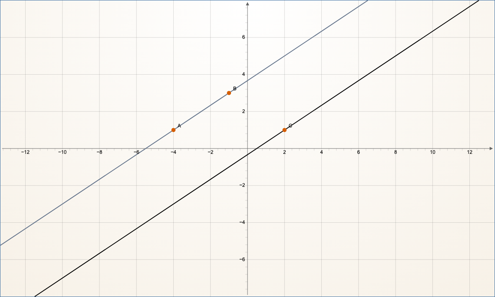</td>
    </tr>
    <tr>
      <td><code>parallelogram</code></td>
      <td>拿三个点补出一个平行四边形。</td>
      <td style="width:260px;"><pre style="margin:0; white-space:pre-wrap; word-break:break-word; overflow-wrap:anywhere; font-size:12px;"><code>board.create(&#x27;parallelogram&#x27;, [A, B, C]);</code></pre></td>
      <td>用三点构造平行四边形。</td>
      <td><strong>一致</strong></td>
      <td>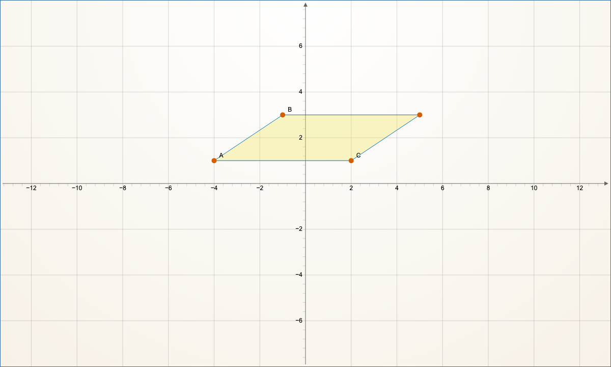</td>
    </tr>
    <tr>
      <td><code>parallelpoint</code></td>
      <td>帮你补出平行四边形缺的第四个点。</td>
      <td style="width:260px;"><pre style="margin:0; white-space:pre-wrap; word-break:break-word; overflow-wrap:anywhere; font-size:12px;"><code>board.create(&#x27;parallelpoint&#x27;, [A, B, C]);</code></pre></td>
      <td>创建能与已有三点组成平行四边形的第四个点。</td>
      <td><strong>部分一致</strong></td>
      <td>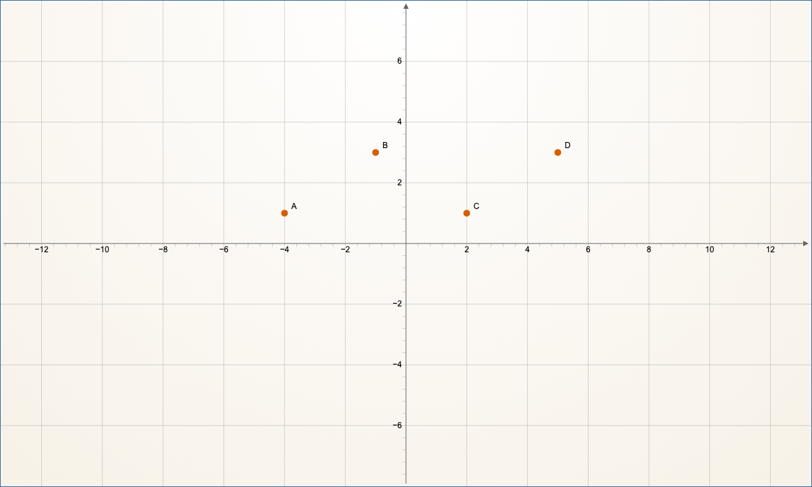</td>
    </tr>
    <tr>
      <td><code>parametricsurface3d</code></td>
      <td>按参数方程画一整张 3D 曲面。</td>
      <td style="width:260px;"><pre style="margin:0; white-space:pre-wrap; word-break:break-word; overflow-wrap:anywhere; font-size:12px;"><code>view.create(&#x27;parametricsurface3d&#x27;, [(u, v) =&gt; (3 + Math.cos(v)) * Math.cos(u), (u, v) =&gt; (3 + Math.cos(v)) * Math.sin(u), (u, v) =&gt; Math.sin(v), [0, 2 * Math.PI], [0, 2 * Math.PI]], { stepsU: 24, stepsV: 16, fillOpacity: 0.45 });</code></pre></td>
      <td>创建三维参数曲面。</td>
      <td><strong>部分一致</strong></td>
      <td>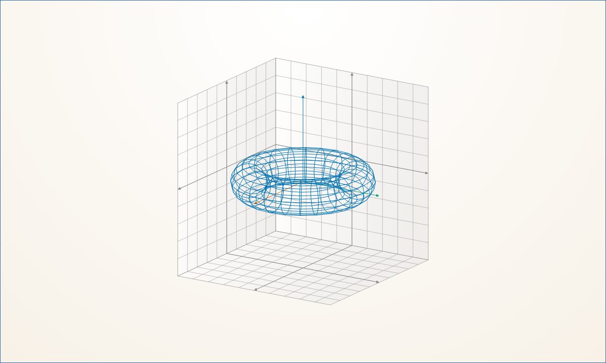</td>
    </tr>
    <tr>
      <td><code>perpendicular</code></td>
      <td>直线 + 点</td>
      <td style="width:260px;"><pre style="margin:0; white-space:pre-wrap; word-break:break-word; overflow-wrap:anywhere; font-size:12px;"><code>board.create(&#x27;perpendicular&#x27;, [lAB, C]);</code></pre></td>
      <td>创建过指定点且垂直于目标直线的直线。</td>
      <td><strong>一致</strong></td>
      <td>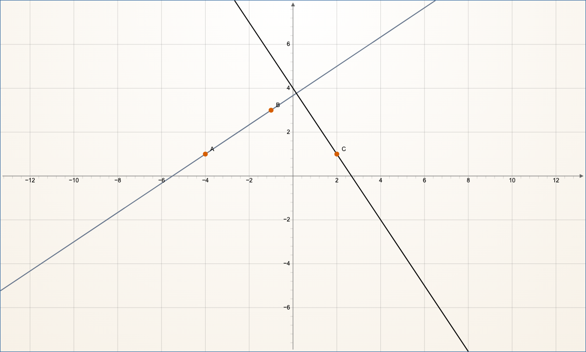</td>
    </tr>
    <tr>
      <td><code>perpendicularpoint</code></td>
      <td>找垂足。</td>
      <td style="width:260px;"><pre style="margin:0; white-space:pre-wrap; word-break:break-word; overflow-wrap:anywhere; font-size:12px;"><code>board.create(&#x27;perpendicularpoint&#x27;, [C, lAB]);</code></pre></td>
      <td>创建点在直线上的垂足。</td>
      <td><strong>部分一致</strong></td>
      <td></td>
    </tr>
    <tr>
      <td><code>perpendicularsegment</code></td>
      <td>直线 + 点</td>
      <td style="width:260px;"><pre style="margin:0; white-space:pre-wrap; word-break:break-word; overflow-wrap:anywhere; font-size:12px;"><code>board.create(&#x27;perpendicularsegment&#x27;, [lAB, C]);</code></pre></td>
      <td>创建从点到直线的垂线段。</td>
      <td><strong>部分一致</strong></td>
      <td>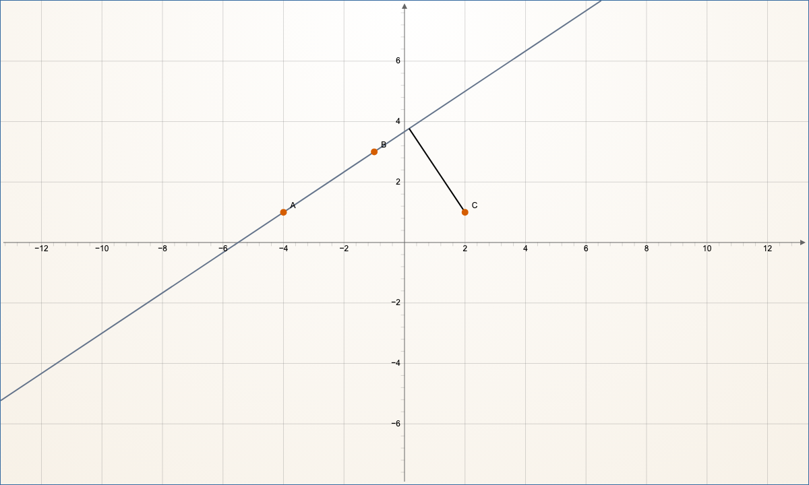</td>
    </tr>
    <tr>
      <td><code>plane3d</code></td>
      <td>画一个 3D 平面。</td>
      <td style="width:260px;"><pre style="margin:0; white-space:pre-wrap; word-break:break-word; overflow-wrap:anywhere; font-size:12px;"><code>view.create(&#x27;plane3d&#x27;, [[0, 0, 0], [1, 0, 0], [0, 1, 0], [-2, 2], [-2, 2]]);</code></pre></td>
      <td>创建三维平面。</td>
      <td><strong>一致</strong></td>
      <td>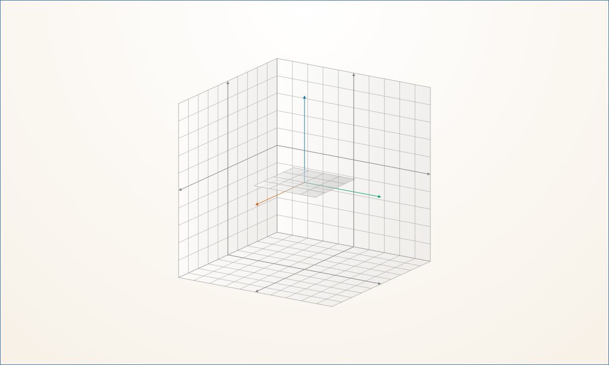</td>
    </tr>
    <tr>
      <td><code>plot</code></td>
      <td>functiongraph 的另一个叫法，本质还是画函数。</td>
      <td style="width:260px;"><pre style="margin:0; white-space:pre-wrap; word-break:break-word; overflow-wrap:anywhere; font-size:12px;"><code>board.create(&#x27;plot&#x27;, [x =&gt; Math.cos(x)], { strokeColor: &#x27;#ef4444&#x27; });</code></pre></td>
      <td>`functiongraph` 的别名。</td>
      <td><strong>部分一致</strong></td>
      <td>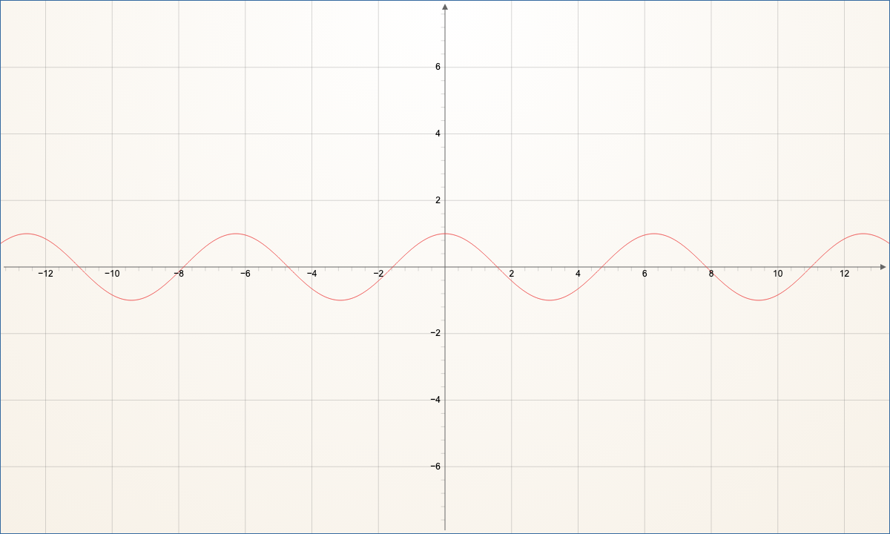</td>
    </tr>
    <tr>
      <td><code>point</code></td>
      <td>画点。</td>
      <td style="width:260px;"><pre style="margin:0; white-space:pre-wrap; word-break:break-word; overflow-wrap:anywhere; font-size:12px;"><code>board.create(&#x27;point&#x27;, [1, 2]);</code></pre></td>
      <td>创建二维点。</td>
      <td><strong>一致</strong></td>
      <td>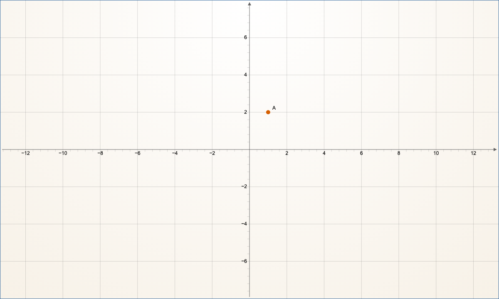</td>
    </tr>
    <tr>
      <td><code>point3d</code></td>
      <td>在空间里放一个点。</td>
      <td style="width:260px;"><pre style="margin:0; white-space:pre-wrap; word-break:break-word; overflow-wrap:anywhere; font-size:12px;"><code>view.create(&#x27;point3d&#x27;, [1, 2, 3]);</code></pre></td>
      <td>创建三维点。</td>
      <td><strong>一致</strong></td>
      <td></td>
    </tr>
    <tr>
      <td><code>polar</code></td>
      <td>圆锥曲线/圆 + 点</td>
      <td style="width:260px;"><pre style="margin:0; white-space:pre-wrap; word-break:break-word; overflow-wrap:anywhere; font-size:12px;"><code>board.create(&#x27;polar&#x27;, [c1, C]);</code></pre></td>
      <td>创建极线；在源码里是 `tangent` 的别名入口之一。</td>
      <td><strong>部分一致</strong></td>
      <td></td>
    </tr>
    <tr>
      <td><code>polarline</code></td>
      <td>圆锥曲线/圆 + 点</td>
      <td style="width:260px;"><pre style="margin:0; white-space:pre-wrap; word-break:break-word; overflow-wrap:anywhere; font-size:12px;"><code>board.create(&#x27;polarline&#x27;, [c1, C]);</code></pre></td>
      <td>创建点相对于圆或圆锥曲线的极线。</td>
      <td><strong>一致</strong></td>
      <td>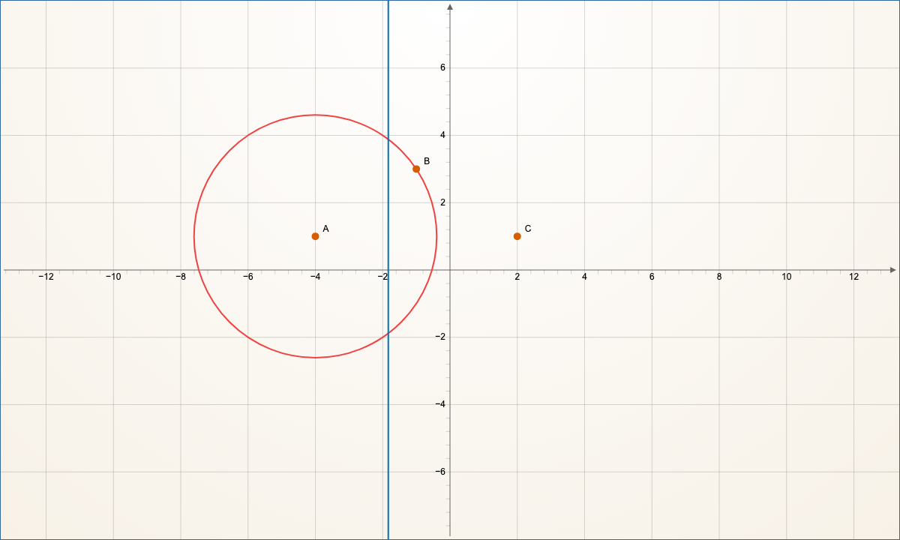</td>
    </tr>
    <tr>
      <td><code>polepoint</code></td>
      <td>圆锥曲线/圆 + 线/点</td>
      <td style="width:260px;"><pre style="margin:0; white-space:pre-wrap; word-break:break-word; overflow-wrap:anywhere; font-size:12px;"><code>board.create(&#x27;polepoint&#x27;, [c1, lAB]);</code></pre></td>
      <td>创建极线对应的极点。</td>
      <td><strong>部分一致</strong></td>
      <td>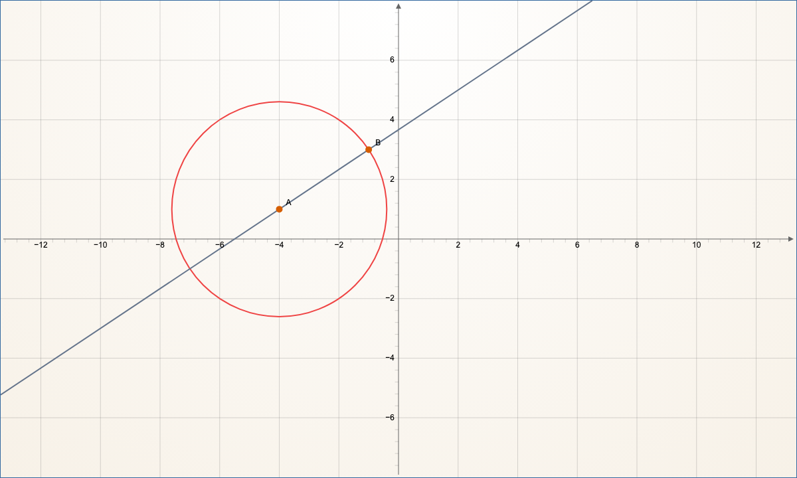</td>
    </tr>
    <tr>
      <td><code>polygon</code></td>
      <td>画多边形。</td>
      <td style="width:260px;"><pre style="margin:0; white-space:pre-wrap; word-break:break-word; overflow-wrap:anywhere; font-size:12px;"><code>board.create(&#x27;polygon&#x27;, [A, B, C, D]);</code></pre></td>
      <td>创建二维多边形。</td>
      <td><strong>一致</strong></td>
      <td>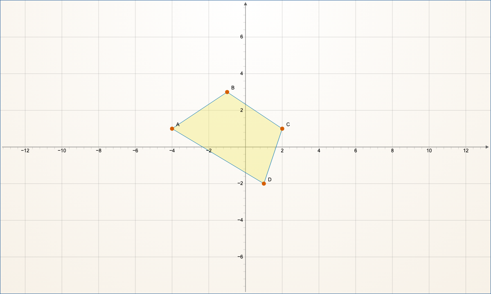</td>
    </tr>
    <tr>
      <td><code>polygon3d</code></td>
      <td>画 3D 多边形面。</td>
      <td style="width:260px;"><pre style="margin:0; white-space:pre-wrap; word-break:break-word; overflow-wrap:anywhere; font-size:12px;"><code>view.create(&#x27;polygon3d&#x27;, [[0, 0, 0], [2, 0, 0], [1, 2, 0]]);</code></pre></td>
      <td>创建三维多边形。</td>
      <td><strong>一致</strong></td>
      <td>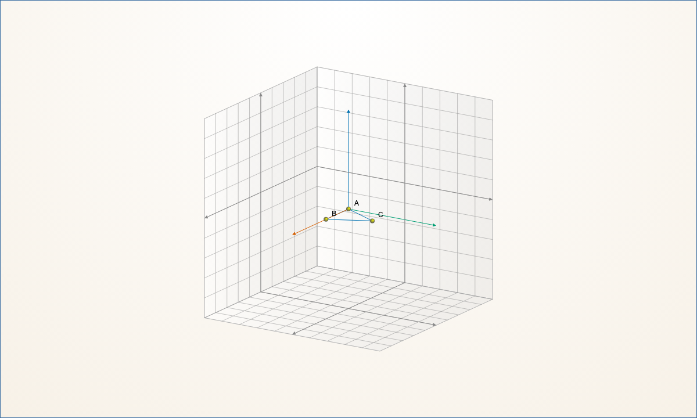</td>
    </tr>
    <tr>
      <td><code>polygonalchain</code></td>
      <td>画折线，但不自动封口。</td>
      <td style="width:260px;"><pre style="margin:0; white-space:pre-wrap; word-break:break-word; overflow-wrap:anywhere; font-size:12px;"><code>board.create(&#x27;polygonalchain&#x27;, [A, B, C, D]);</code></pre></td>
      <td>创建折线链，不自动闭合。</td>
      <td><strong>部分一致</strong></td>
      <td>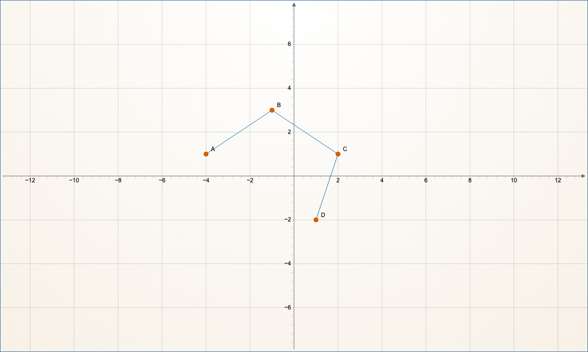</td>
    </tr>
    <tr>
      <td><code>polyhedron3d</code></td>
      <td>画一个完整 3D 多面体。</td>
      <td style="width:260px;"><pre style="margin:0; white-space:pre-wrap; word-break:break-word; overflow-wrap:anywhere; font-size:12px;"><code>view.create(&#x27;polyhedron3d&#x27;, [[[0,0,0],[2,0,0],[2,2,0],[0,2,0],[0,0,2],[2,0,2],[2,2,2],[0,2,2]], [[0,1,2,3],[4,5,6,7],[0,1,5,4],[1,2,6,5],[2,3,7,6],[3,0,4,7]]], { fillOpacity: 0.2 });</code></pre></td>
      <td>创建三维多面体。</td>
      <td><strong>部分一致</strong></td>
      <td>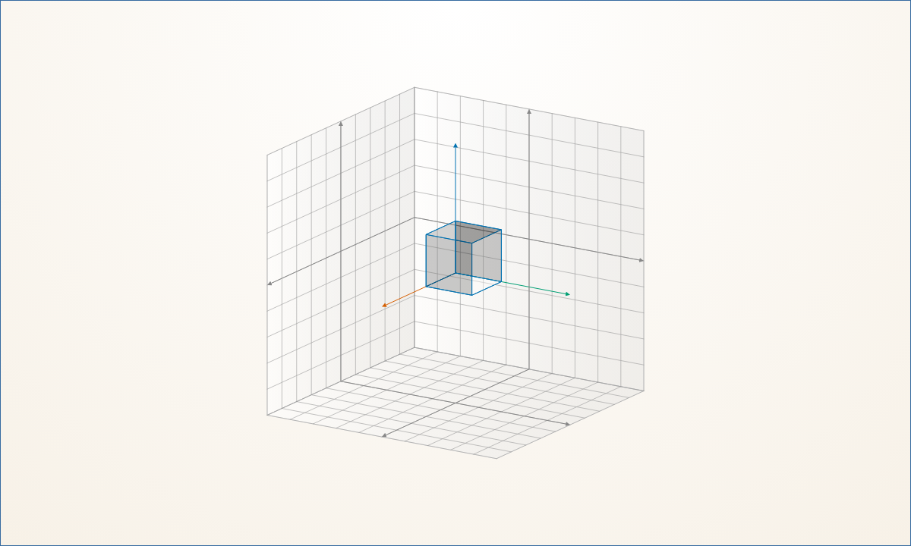</td>
    </tr>
    <tr>
      <td><code>radicalaxis</code></td>
      <td>找两个圆的根轴。</td>
      <td style="width:260px;"><pre style="margin:0; white-space:pre-wrap; word-break:break-word; overflow-wrap:anywhere; font-size:12px;"><code>board.create(&#x27;radicalaxis&#x27;, [c1, c2]);</code></pre></td>
      <td>创建两圆的根轴。</td>
      <td><strong>一致</strong></td>
      <td>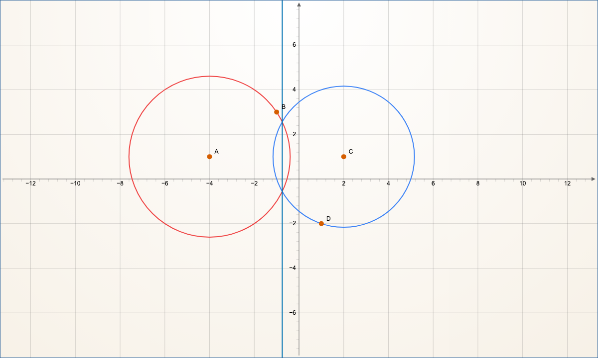</td>
    </tr>
    <tr>
      <td><code>reflection</code></td>
      <td>对象 + 直线</td>
      <td style="width:260px;"><pre style="margin:0; white-space:pre-wrap; word-break:break-word; overflow-wrap:anywhere; font-size:12px;"><code>board.create(&#x27;reflection&#x27;, [A, lCD]);</code></pre></td>
      <td>按直线对一个对象做镜像反射。</td>
      <td><strong>一致</strong></td>
      <td>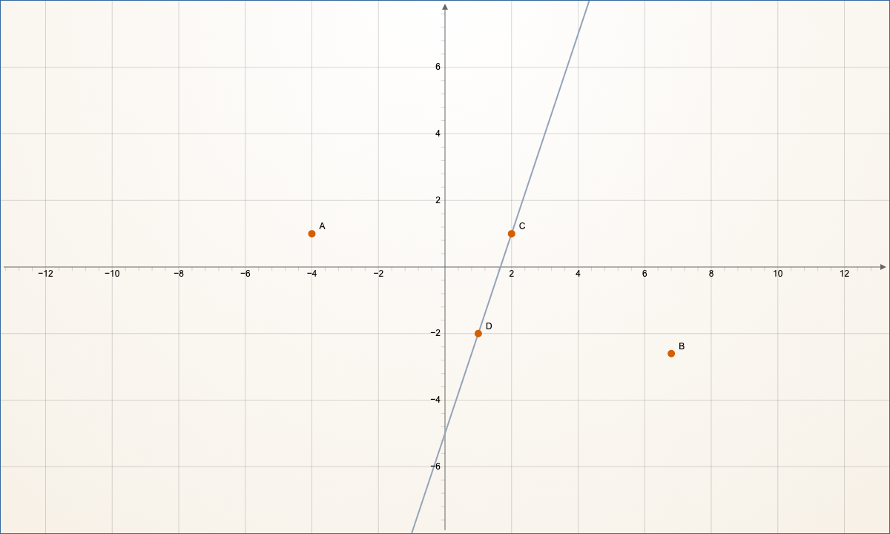</td>
    </tr>
    <tr>
      <td><code>reflexangle</code></td>
      <td>强制取大于 180 度的那个反角。</td>
      <td style="width:260px;"><pre style="margin:0; white-space:pre-wrap; word-break:break-word; overflow-wrap:anywhere; font-size:12px;"><code>board.create(&#x27;reflexangle&#x27;, [A, B, C]);</code></pre></td>
      <td>创建大于 180 度的反角对象。</td>
      <td><strong>部分一致</strong></td>
      <td>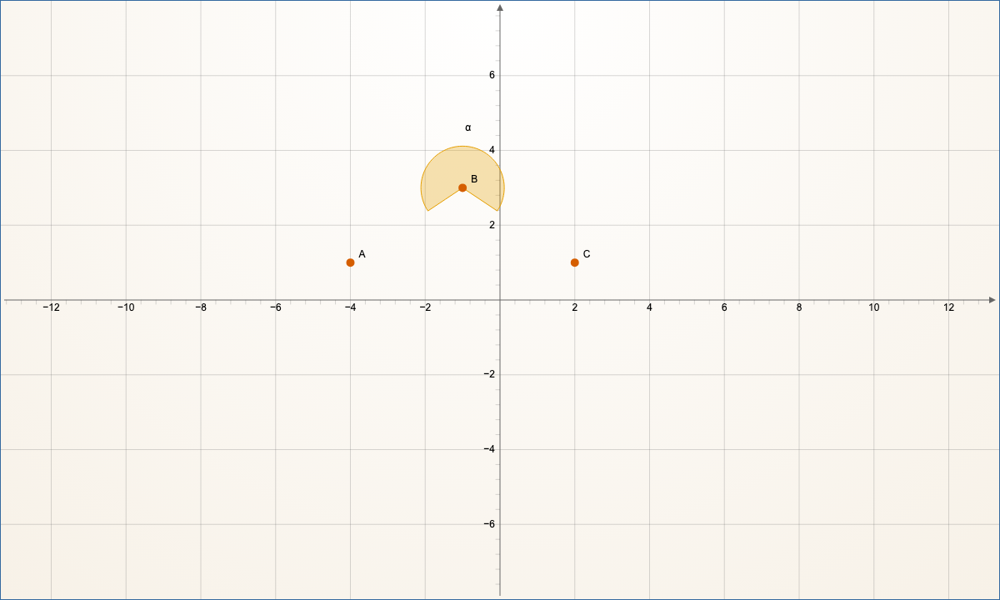</td>
    </tr>
    <tr>
      <td><code>regularpolygon</code></td>
      <td>画正多边形。</td>
      <td style="width:260px;"><pre style="margin:0; white-space:pre-wrap; word-break:break-word; overflow-wrap:anywhere; font-size:12px;"><code>board.create(&#x27;regularpolygon&#x27;, [A, B, 5]);</code></pre></td>
      <td>创建正多边形。</td>
      <td><strong>一致</strong></td>
      <td>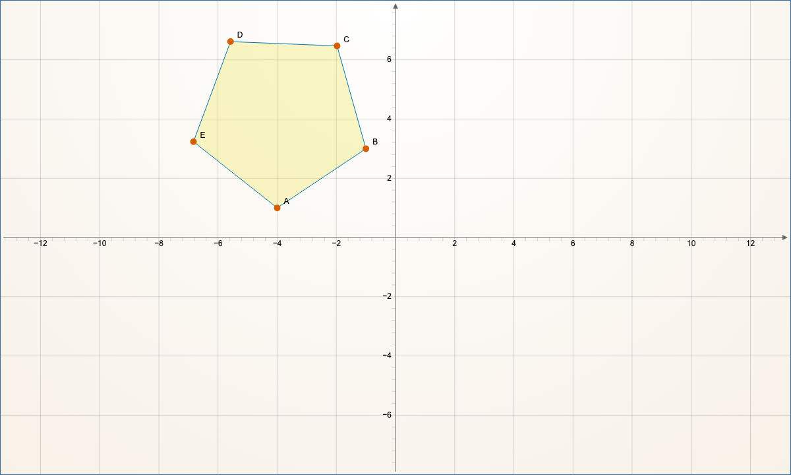</td>
    </tr>
    <tr>
      <td><code>riemannsum</code></td>
      <td>把积分近似成一块一块的小矩形。</td>
      <td style="width:260px;"><pre style="margin:0; white-space:pre-wrap; word-break:break-word; overflow-wrap:anywhere; font-size:12px;"><code>board.create(&#x27;riemannsum&#x27;, [x =&gt; Math.sin(x) + 2, 8, &#x27;left&#x27;, -3, 3]);</code></pre></td>
      <td>创建黎曼和图形，用于近似积分。</td>
      <td><strong>一致</strong></td>
      <td>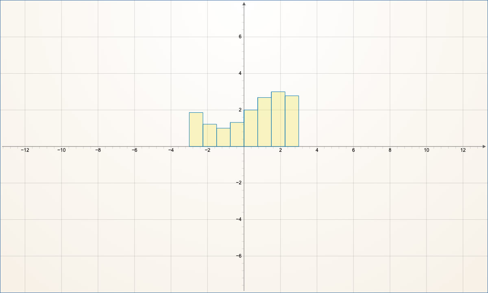</td>
    </tr>
    <tr>
      <td><code>sector</code></td>
      <td>画扇形。</td>
      <td style="width:260px;"><pre style="margin:0; white-space:pre-wrap; word-break:break-word; overflow-wrap:anywhere; font-size:12px;"><code>board.create(&#x27;sector&#x27;, [A, B, C]);</code></pre></td>
      <td>创建扇形区域。</td>
      <td><strong>一致</strong></td>
      <td></td>
    </tr>
    <tr>
      <td><code>segment</code></td>
      <td>画线段。</td>
      <td style="width:260px;"><pre style="margin:0; white-space:pre-wrap; word-break:break-word; overflow-wrap:anywhere; font-size:12px;"><code>board.create(&#x27;segment&#x27;, [A, B]);</code></pre></td>
      <td>创建线段。</td>
      <td><strong>一致</strong></td>
      <td></td>
    </tr>
    <tr>
      <td><code>semicircle</code></td>
      <td>画半圆。</td>
      <td style="width:260px;"><pre style="margin:0; white-space:pre-wrap; word-break:break-word; overflow-wrap:anywhere; font-size:12px;"><code>board.create(&#x27;semicircle&#x27;, [A, B]);</code></pre></td>
      <td>创建半圆。</td>
      <td><strong>一致</strong></td>
      <td>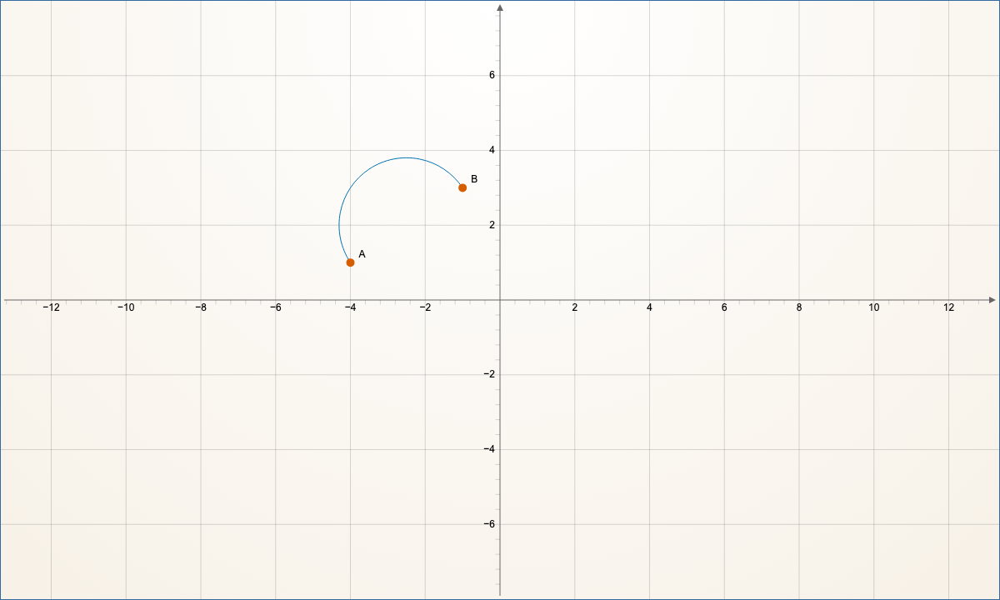</td>
    </tr>
    <tr>
      <td><code>slider</code></td>
      <td>画一个可拖动的数值滑块。</td>
      <td style="width:260px;"><pre style="margin:0; white-space:pre-wrap; word-break:break-word; overflow-wrap:anywhere; font-size:12px;"><code>board.create(&#x27;slider&#x27;, [[-7, 3], [-1, 3], [0, 2, 5]]);</code></pre></td>
      <td>创建滑块。</td>
      <td><strong>一致</strong></td>
      <td>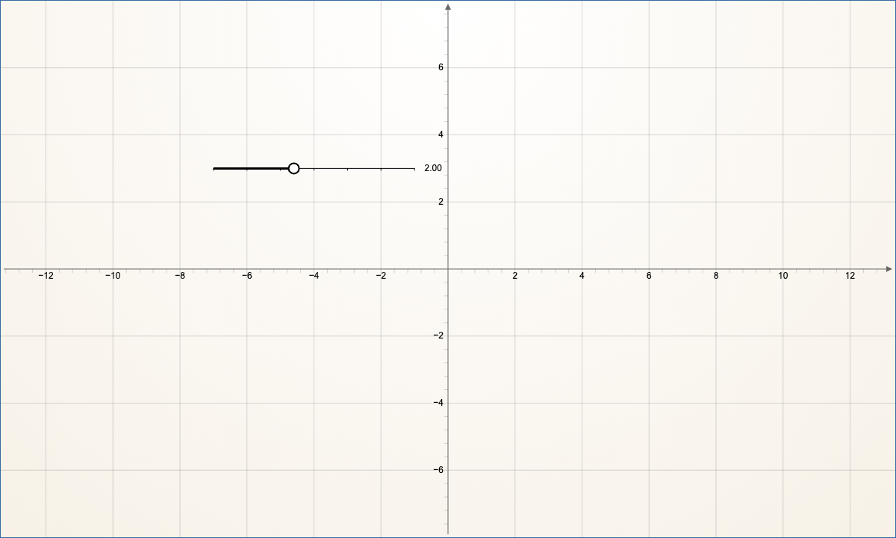</td>
    </tr>
    <tr>
      <td><code>slopefield</code></td>
      <td>画微分方程的斜率场。</td>
      <td style="width:260px;"><pre style="margin:0; white-space:pre-wrap; word-break:break-word; overflow-wrap:anywhere; font-size:12px;"><code>board.create(&#x27;slopefield&#x27;, [(x, y) =&gt; x - y, [-4, 10, 4], [-4, 10, 4]]);</code></pre></td>
      <td>创建微分方程斜率场。</td>
      <td><strong>一致</strong></td>
      <td>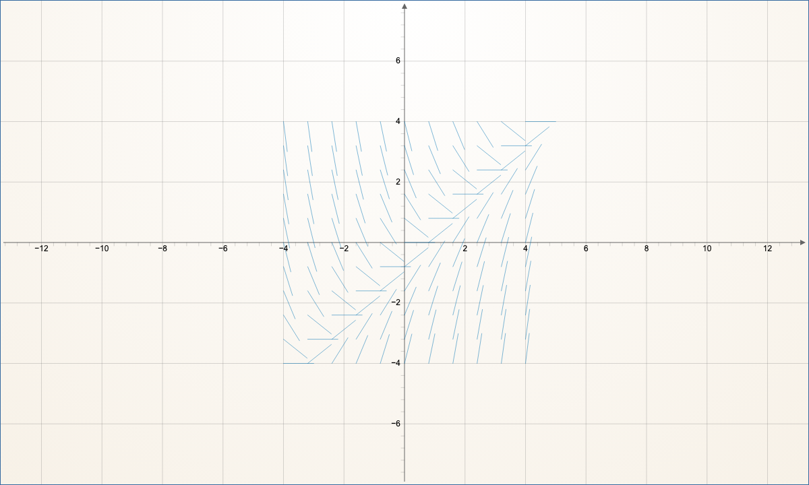</td>
    </tr>
    <tr>
      <td><code>slopetriangle</code></td>
      <td>在线上配一个斜率三角形，方便看 rise/run。</td>
      <td style="width:260px;"><pre style="margin:0; white-space:pre-wrap; word-break:break-word; overflow-wrap:anywhere; font-size:12px;"><code>board.create(&#x27;slopetriangle&#x27;, [tangentFg]);</code></pre></td>
      <td>创建斜率三角形，用于直观显示斜率。</td>
      <td><strong>部分一致</strong></td>
      <td>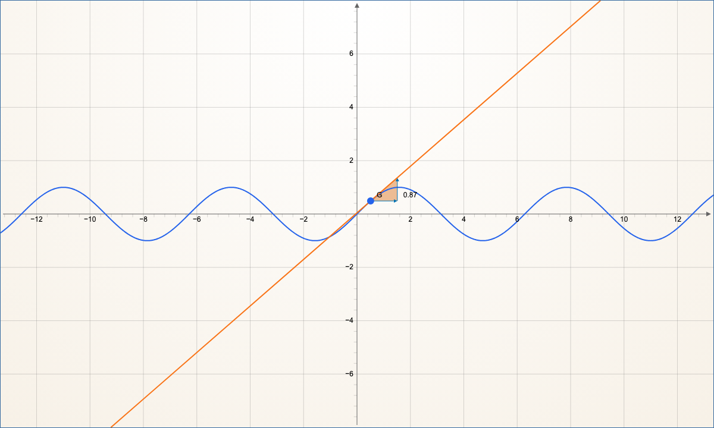</td>
    </tr>
    <tr>
      <td><code>smartlabel</code></td>
      <td>父对象 + 可选文本</td>
      <td style="width:260px;"><pre style="margin:0; white-space:pre-wrap; word-break:break-word; overflow-wrap:anywhere; font-size:12px;"><code>board.create(&#x27;smartlabel&#x27;, [segAB]);</code></pre></td>
      <td>创建智能标签，可自动显示长度、面积、角度等测量结果。</td>
      <td><strong>不一致</strong></td>
      <td>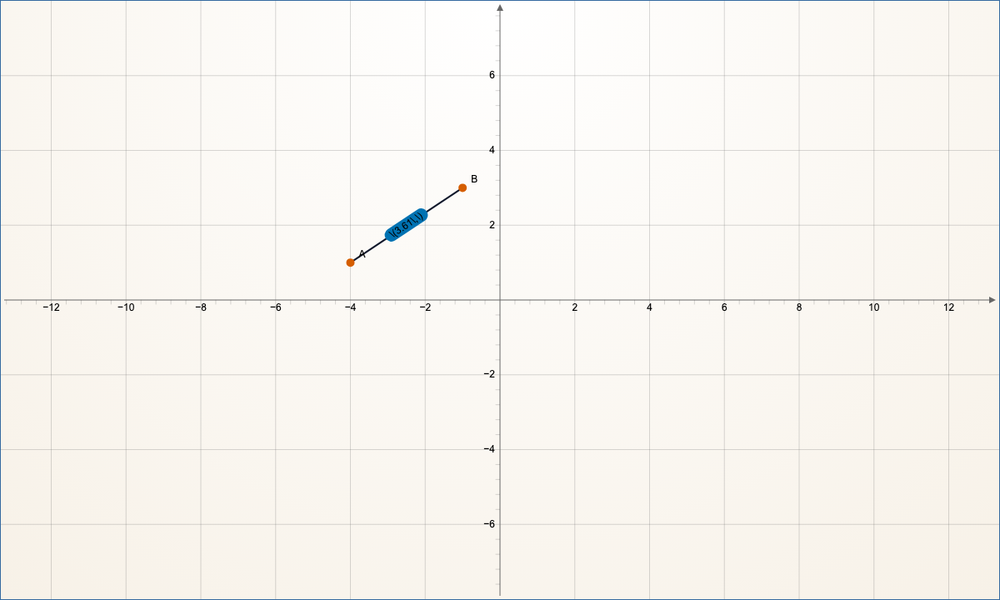</td>
    </tr>
    <tr>
      <td><code>sphere3d</code></td>
      <td>画球。</td>
      <td style="width:260px;"><pre style="margin:0; white-space:pre-wrap; word-break:break-word; overflow-wrap:anywhere; font-size:12px;"><code>view.create(&#x27;sphere3d&#x27;, [Q1, 2]);</code></pre></td>
      <td>创建球体。</td>
      <td><strong>一致</strong></td>
      <td>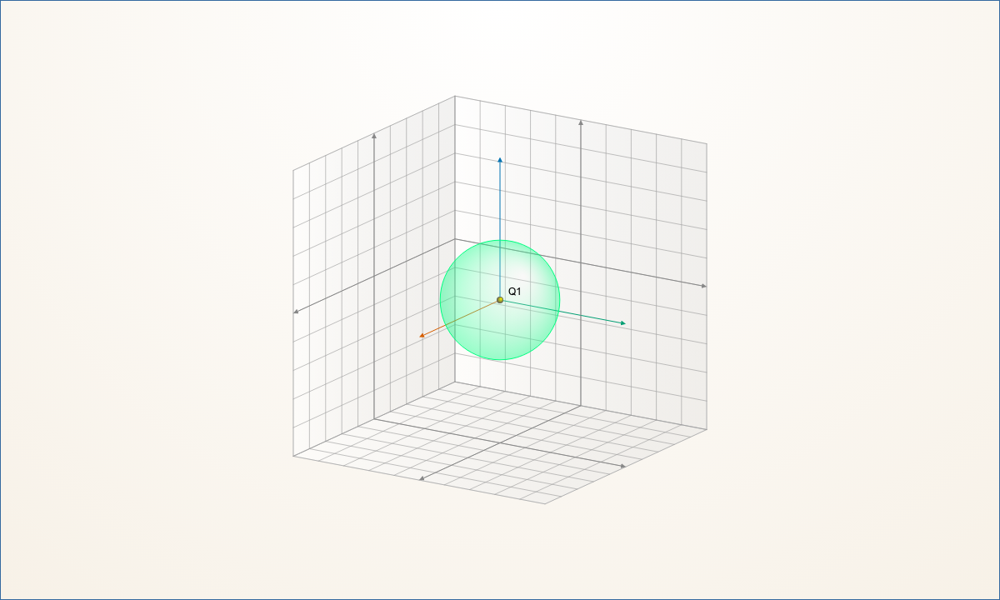</td>
    </tr>
    <tr>
      <td><code>spline</code></td>
      <td>用样条方式平滑连点。</td>
      <td style="width:260px;"><pre style="margin:0; white-space:pre-wrap; word-break:break-word; overflow-wrap:anywhere; font-size:12px;"><code>board.create(&#x27;spline&#x27;, [[A, B, C, D]]);</code></pre></td>
      <td>创建样条插值曲线。</td>
      <td><strong>部分一致</strong></td>
      <td>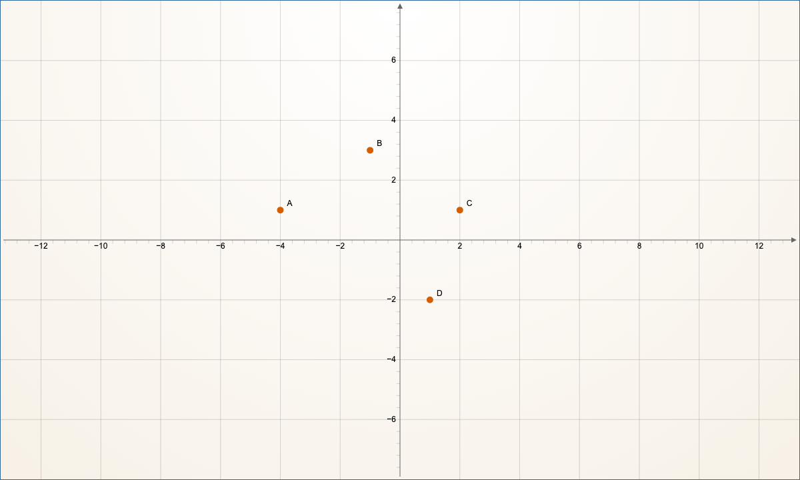</td>
    </tr>
    <tr>
      <td><code>stepfunction</code></td>
      <td>画阶梯函数。</td>
      <td style="width:260px;"><pre style="margin:0; white-space:pre-wrap; word-break:break-word; overflow-wrap:anywhere; font-size:12px;"><code>board.create(&#x27;stepfunction&#x27;, [[-3, -1, 1, 3], [1, 3, 2, 4]]);</code></pre></td>
      <td>创建阶梯函数图像。</td>
      <td><strong>部分一致</strong></td>
      <td>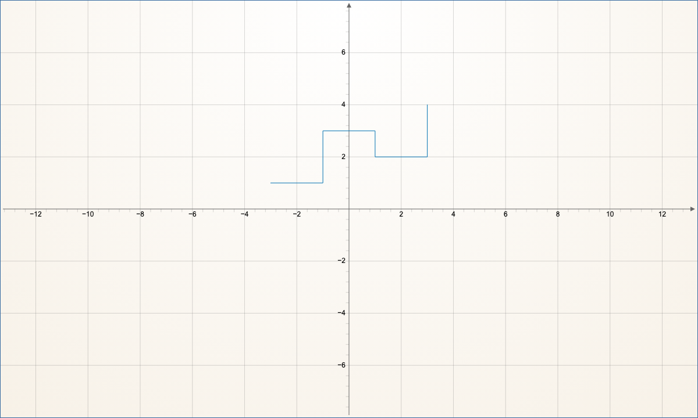</td>
    </tr>
    <tr>
      <td><code>tangent</code></td>
      <td>画切线。</td>
      <td style="width:260px;"><pre style="margin:0; white-space:pre-wrap; word-break:break-word; overflow-wrap:anywhere; font-size:12px;"><code>board.create(&#x27;tangent&#x27;, [G]);</code></pre></td>
      <td>创建切线。</td>
      <td><strong>一致</strong></td>
      <td>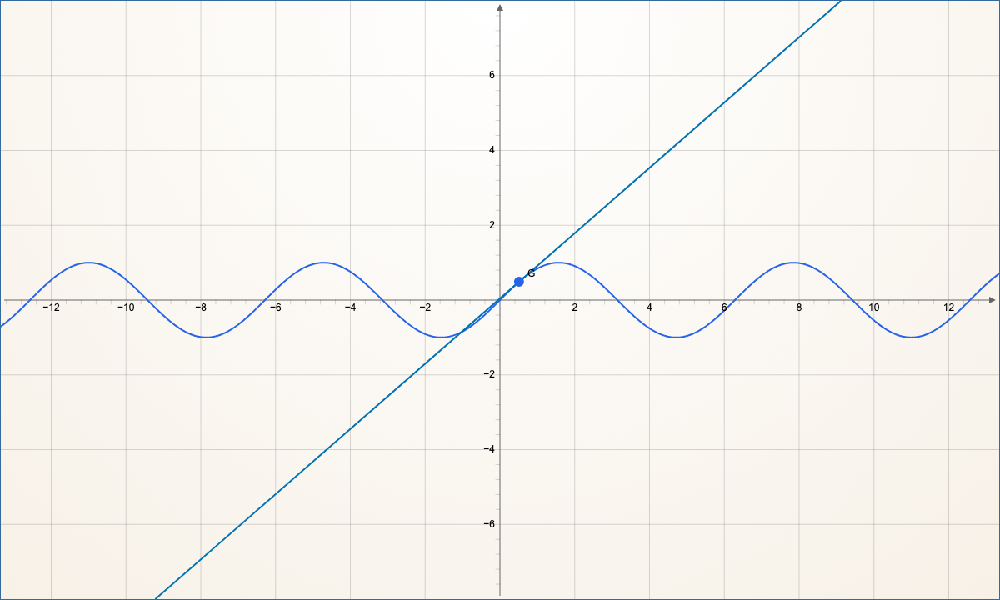</td>
    </tr>
    <tr>
      <td><code>tangentto</code></td>
      <td>从外部一点向圆或曲线作切线。</td>
      <td style="width:260px;"><pre style="margin:0; white-space:pre-wrap; word-break:break-word; overflow-wrap:anywhere; font-size:12px;"><code>board.create(&#x27;tangentto&#x27;, [c1, D, 0]);</code></pre></td>
      <td>创建从外部点引向圆或圆锥曲线的切线。</td>
      <td><strong>部分一致</strong></td>
      <td>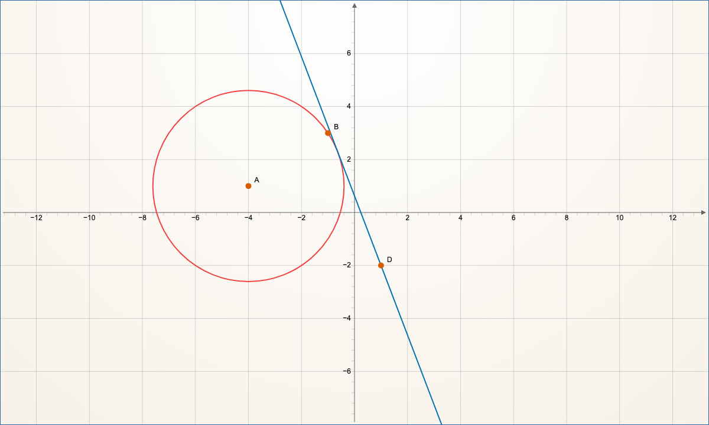</td>
    </tr>
    <tr>
      <td><code>tapemeasure</code></td>
      <td>像卷尺一样量两点距离。</td>
      <td style="width:260px;"><pre style="margin:0; white-space:pre-wrap; word-break:break-word; overflow-wrap:anywhere; font-size:12px;"><code>board.create(&#x27;tapemeasure&#x27;, [[-4, -5], [3, -5]]);</code></pre></td>
      <td>创建卷尺/测距工具。</td>
      <td><strong>部分一致</strong></td>
      <td>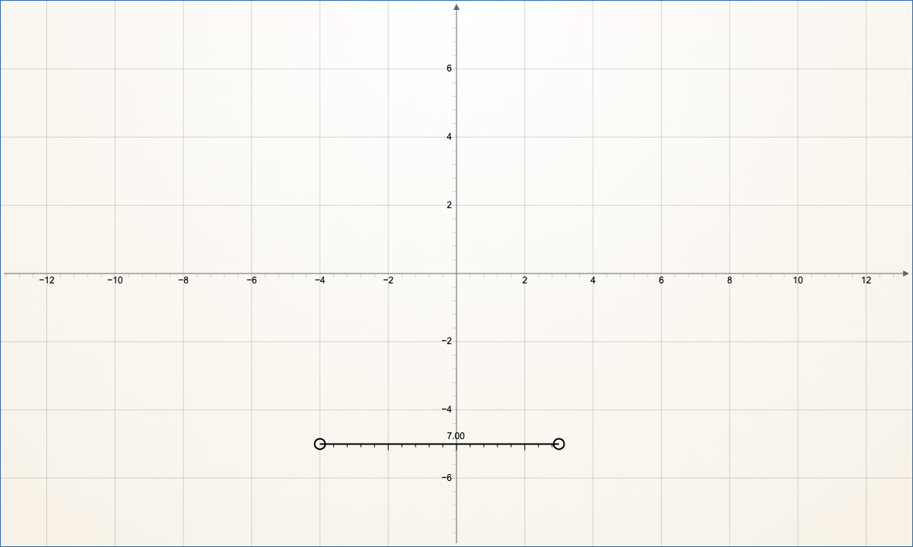</td>
    </tr>
    <tr>
      <td><code>text</code></td>
      <td>在画板上写字。</td>
      <td style="width:260px;"><pre style="margin:0; white-space:pre-wrap; word-break:break-word; overflow-wrap:anywhere; font-size:12px;"><code>board.create(&#x27;text&#x27;, [-7, 7.5, &#x27;Hello VueGraphX&#x27;]);</code></pre></td>
      <td>创建文本标签。</td>
      <td><strong>一致</strong></td>
      <td>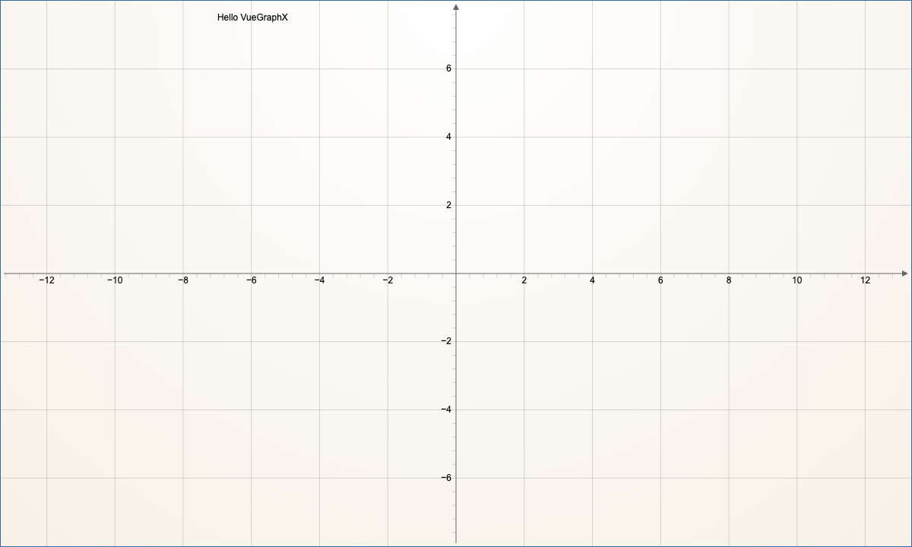</td>
    </tr>
    <tr>
      <td><code>text3d</code></td>
      <td>在 3D 场景里放文字。</td>
      <td style="width:260px;"><pre style="margin:0; white-space:pre-wrap; word-break:break-word; overflow-wrap:anywhere; font-size:12px;"><code>view.create(&#x27;text3d&#x27;, [1, 1, 1, &#x27;P&#x27;]);</code></pre></td>
      <td>创建三维文本标签。</td>
      <td><strong>一致</strong></td>
      <td></td>
    </tr>
    <tr>
      <td><code>ticks</code></td>
      <td>直线/曲线 + 刻度数组</td>
      <td style="width:260px;"><pre style="margin:0; white-space:pre-wrap; word-break:break-word; overflow-wrap:anywhere; font-size:12px;"><code>board.create(&#x27;ticks&#x27;, [lAB, [-2, -1, 0, 1, 2]]);</code></pre></td>
      <td>创建刻度。</td>
      <td><strong>不一致</strong></td>
      <td>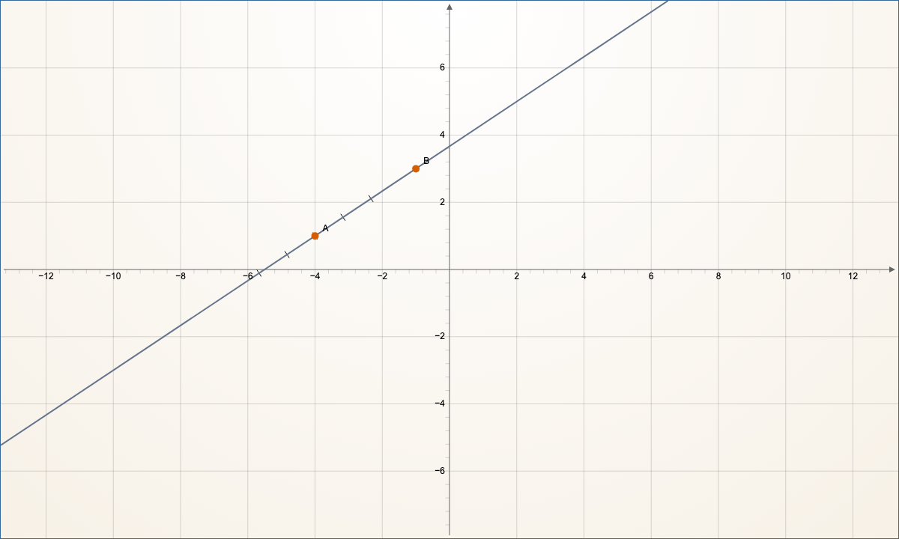</td>
    </tr>
    <tr>
      <td><code>ticks3d</code></td>
      <td>给 3D 轴或线加刻度。</td>
      <td style="width:260px;"><pre style="margin:0; white-space:pre-wrap; word-break:break-word; overflow-wrap:anywhere; font-size:12px;"><code>view.create(&#x27;ticks3d&#x27;, [[0, 0, 0], [1, 0, 0], 4, [0, 0.25, 0]]);</code></pre></td>
      <td>创建三维刻度。</td>
      <td><strong>不一致</strong></td>
      <td></td>
    </tr>
    <tr>
      <td><code>tracecurve</code></td>
      <td>把运动点走过的轨迹留下来。</td>
      <td style="width:260px;"><pre style="margin:0; white-space:pre-wrap; word-break:break-word; overflow-wrap:anywhere; font-size:12px;"><code>board.create(&#x27;tracecurve&#x27;, [G, T]);</code></pre></td>
      <td>创建轨迹曲线，显示某个点随另一点运动的轨迹。</td>
      <td><strong>部分一致</strong></td>
      <td>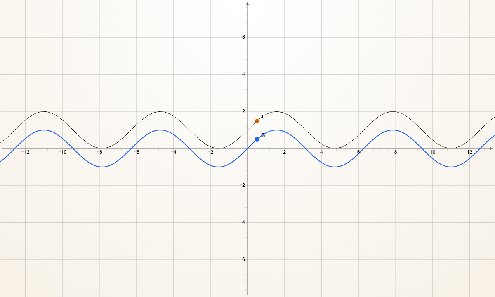</td>
    </tr>
    <tr>
      <td><code>transform</code></td>
      <td>先定义一个平移旋转缩放规则，后面图形都能复用。</td>
      <td style="width:260px;"><pre style="margin:0; white-space:pre-wrap; word-break:break-word; overflow-wrap:anywhere; font-size:12px;"><code>const tr = board.create(&#x27;transform&#x27;, [1.5, 0.5], { type: &#x27;translate&#x27; }); board.create(&#x27;point&#x27;, [A, tr], { name: &#x27;A1&#x27; });</code></pre></td>
      <td>创建二维变换对象，供其它元素复用。</td>
      <td><strong>部分一致</strong></td>
      <td>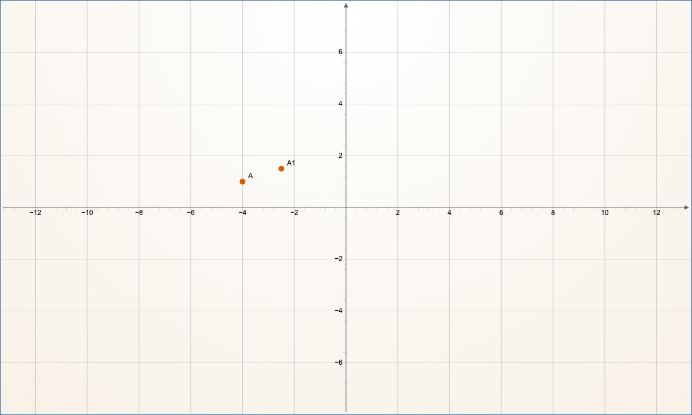</td>
    </tr>
    <tr>
      <td><code>transform3d</code></td>
      <td>3D 版的平移旋转缩放规则。</td>
      <td style="width:260px;"><pre style="margin:0; white-space:pre-wrap; word-break:break-word; overflow-wrap:anywhere; font-size:12px;"><code>const rot = view.create(&#x27;transform3d&#x27;, [Math.PI / 6], { type: &#x27;rotateZ&#x27; });</code></pre></td>
      <td>创建三维变换对象，供其它元素复用。</td>
      <td><strong>部分一致</strong></td>
      <td></td>
    </tr>
    <tr>
      <td><code>turtle</code></td>
      <td>画板 + 选项</td>
      <td style="width:260px;"><pre style="margin:0; white-space:pre-wrap; word-break:break-word; overflow-wrap:anywhere; font-size:12px;"><code>const turtle = board.create(&#x27;turtle&#x27;, []); turtle.forward(2); turtle.right(120); turtle.forward(2); turtle.right(120); turtle.forward(2);</code></pre></td>
      <td>创建海龟绘图对象。</td>
      <td><strong>一致</strong></td>
      <td>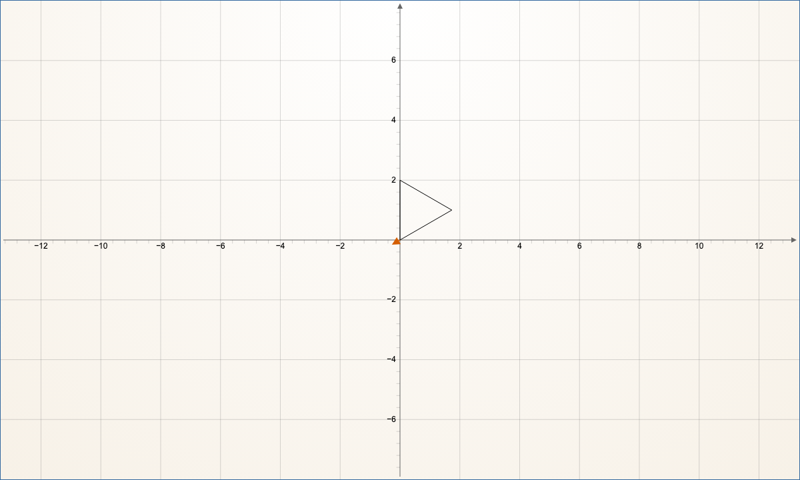</td>
    </tr>
    <tr>
      <td><code>vectorfield</code></td>
      <td>画二维向量场。</td>
      <td style="width:260px;"><pre style="margin:0; white-space:pre-wrap; word-break:break-word; overflow-wrap:anywhere; font-size:12px;"><code>board.create(&#x27;vectorfield&#x27;, [[(x, y) =&gt; -y, (x, y) =&gt; x], [-4, 8, 4], [-4, 8, 4]]);</code></pre></td>
      <td>创建二维向量场。</td>
      <td><strong>一致</strong></td>
      <td>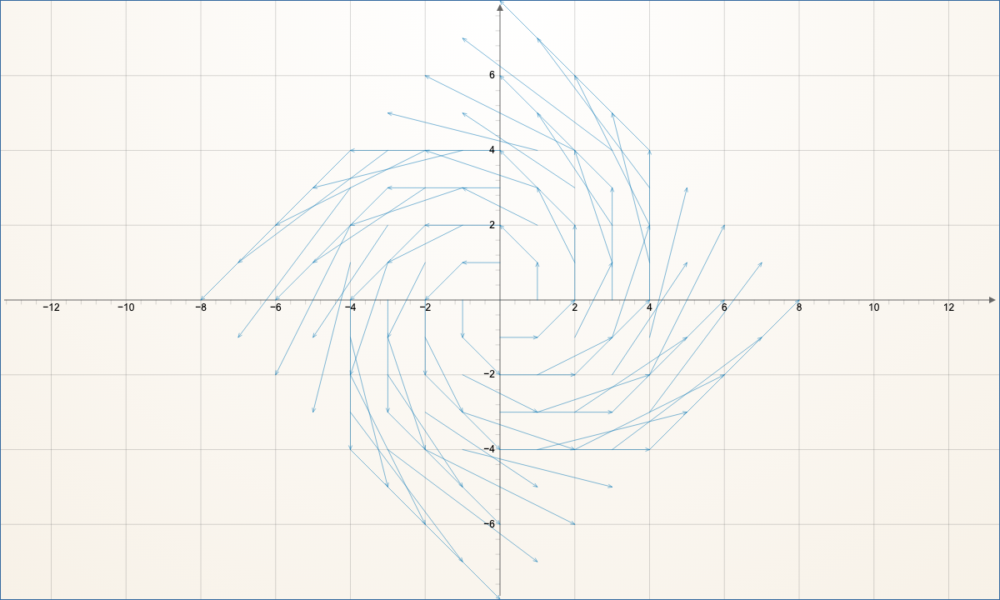</td>
    </tr>
    <tr>
      <td><code>vectorfield3d</code></td>
      <td>画三维向量场。</td>
      <td style="width:260px;"><pre style="margin:0; white-space:pre-wrap; word-break:break-word; overflow-wrap:anywhere; font-size:12px;"><code>view.create(&#x27;vectorfield3d&#x27;, [[(x, y, z) =&gt; y, (x, y, z) =&gt; -x, (x, y, z) =&gt; z], [-2, 4, 2], [-2, 4, 2], [-2, 4, 2]]);</code></pre></td>
      <td>创建三维向量场。</td>
      <td><strong>部分一致</strong></td>
      <td>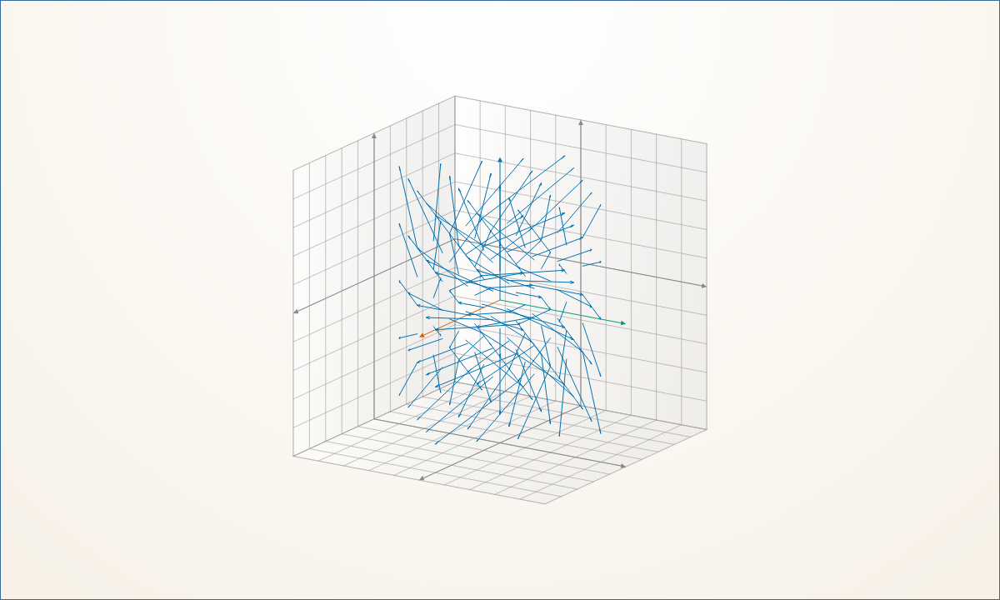</td>
    </tr>
    <tr>
      <td><code>view3d</code></td>
      <td>3D 场景的容器，没有它就没地方放 3D 图形。</td>
      <td style="width:260px;"><pre style="margin:0; white-space:pre-wrap; word-break:break-word; overflow-wrap:anywhere; font-size:12px;"><code>board3d.create(&#x27;view3d&#x27;, [[-6, -3], [8, 8], [[-5, 5], [-5, 5], [-5, 5]]]);</code></pre></td>
      <td>创建 3D 视图容器，是所有 3D 图元的承载入口。</td>
      <td><strong>不一致</strong></td>
      <td>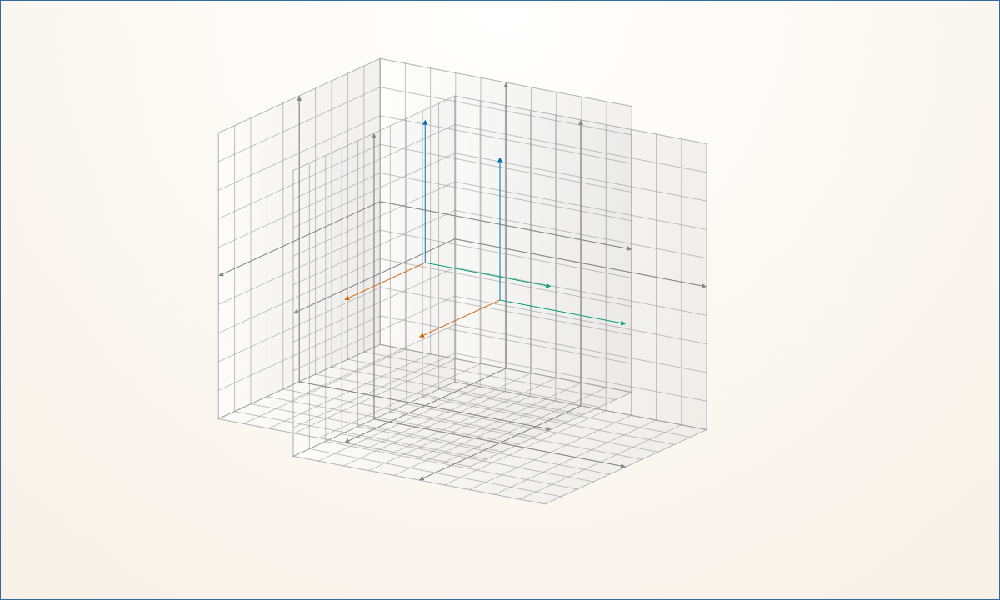</td>
    </tr>
  </tbody>
</table>

